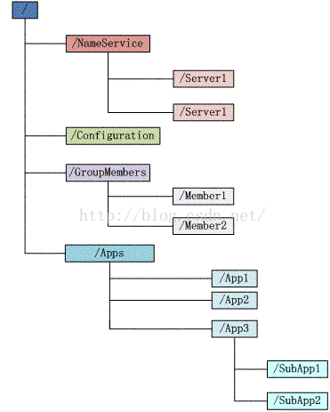
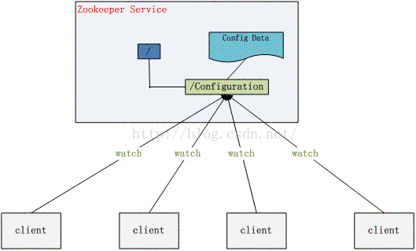
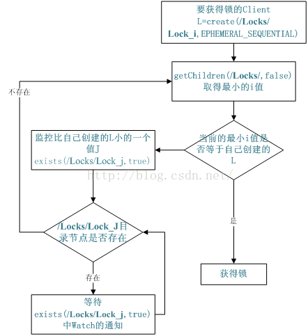
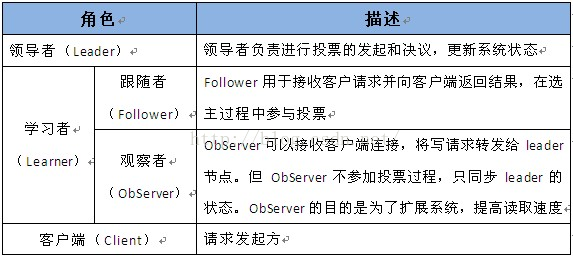
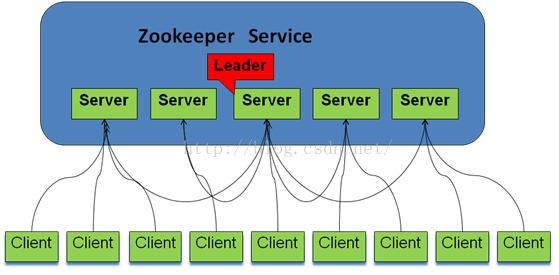

## [原文](http://www.cnblogs.com/felixzh/p/5869212.html)

# Zookeeper的功能

## 1.ZooKeeper是什么？
ZooKeeper是一个分布式的，开放源码的分布式应用程序协调服务，是Google的Chubby一个开源的实现，它是集群的管理者，
监视着集群中各个节点的状态根据节点提交的反馈进行下一步合理操作。
最终，将简单易用的接口和性能高效、功能稳定的系统提供给用户

## 2.ZooKeeper提供了什么？

1) 文件系统

2) 通知机制

## 3.Zookeeper文件系统

每个子目录项如 NameService 都被称作为znode，和文件系统一样，我们能够自由的增加、删除znode，
在一个znode下增加、删除子znode，唯一的不同在于znode是可以存储数据的。 

有四种类型的znode： 

1、PERSISTENT-持久化目录节点 

客户端与zookeeper断开连接后，该节点依旧存在 

2、PERSISTENT_SEQUENTIAL-持久化顺序编号目录节点 

客户端与zookeeper断开连接后，该节点依旧存在，只是Zookeeper给该节点名称进行顺序编号 

3、EPHEMERAL-临时目录节点 

客户端与zookeeper断开连接后，该节点被删除 

4、EPHEMERAL_SEQUENTIAL-临时顺序编号目录节点 

客户端与zookeeper断开连接后，该节点被删除，只是Zookeeper给该节点名称进行顺序编号 

## 4.Zookeeper通知机制

客户端注册监听它关心的目录节点，当目录节点发生变化（数据改变、被删除、子目录节点增加删除）时，zookeeper会通知客户端。

## 5.Zookeeper做了什么？

1.命名服务   2.配置管理   3.集群管理   4.分布式锁  5.队列管理

## 6.Zookeeper命名服务

在zookeeper的文件系统里创建一个目录，即有唯一的path。在我们使用tborg无法确定上游程序的部署机器时即可与下游程序约定好path，
通过path即能互相探索发现。

## 7. Zookeeper的配置管理

程序总是需要配置的，如果程序分散部署在多台机器上，要逐个改变配置就变得困难。现在把这些配置全部放到zookeeper上去，
保存在 Zookeeper 的某个目录节点中，然后所有相关应用程序对这个目录节点进行监听，一旦配置信息发生变化，
每个应用程序就会收到 Zookeeper 的通知，然后从 Zookeeper 获取新的配置信息应用到系统中就好

## 8. Zookeeper集群管理

所谓集群管理无在乎两点：是否有机器退出和加入、选举master。 

对于第一点，所有机器约定在父目录GroupMembers下创建临时目录节点，然后监听父目录节点的子节点变化消息。
一旦有机器挂掉，该机器与 zookeeper的连接断开，其所创建的临时目录节点被删除，所有其他机器都收到通知：某个兄弟目录被删除，
于是，所有人都知道：它上船了。

新机器加入也是类似，所有机器收到通知：新兄弟目录加入，highcount又有了，对于第二点，我们稍微改变一下，
所有机器创建临时顺序编号目录节点，每次选取编号最小的机器作为master就好。

## 9.Zookeeper分布式锁

有了zookeeper的一致性文件系统，锁的问题变得容易。锁服务可以分为两类，一个是保持独占，另一个是控制时序。 

对于第一类，我们将zookeeper上的一个znode看作是一把锁，通过createznode的方式来实现。
所有客户端都去创建 /distribute_lock 节点，最终成功创建的那个客户端也即拥有了这把锁。
用完删除掉自己创建的distribute_lock 节点就释放出锁。 

对于第二类， /distribute_lock 已经预先存在，所有客户端在它下面创建临时顺序编号目录节点，和选master一样，
编号最小的获得锁，用完删除，依次方便。

## 10.Zookeeper队列管理

两种类型的队列：

1、同步队列，当一个队列的成员都聚齐时，这个队列才可用，否则一直等待所有成员到达。 

2、队列按照 FIFO 方式进行入队和出队操作。 

第一类，在约定目录下创建临时目录节点，监听节点数目是否是我们要求的数目。 

第二类，和分布式锁服务中的控制时序场景基本原理一致，入列有编号，出列按编号。

## 11.分布式与数据复制 

Zookeeper作为一个集群提供一致的数据服务，自然，它要在所有机器间做数据复制。数据复制的好处： 

1、容错：一个节点出错，不致于让整个系统停止工作，别的节点可以接管它的工作； 

2、提高系统的扩展能力 ：把负载分布到多个节点上，或者增加节点来提高系统的负载能力； 

3、提高性能：让客户端本地访问就近的节点，提高用户访问速度。 

从客户端读写访问的透明度来看，数据复制集群系统分下面两种： 

1、写主(WriteMaster) ：对数据的修改提交给指定的节点。读无此限制，可以读取任何一个节点。这种情况下客户端需要对读与写进行区别，俗称读写分离； 

2、写任意(Write Any)：对数据的修改可提交给任意的节点，跟读一样。这种情况下，客户端对集群节点的角色与变化透明。

对zookeeper来说，它采用的方式是写任意。通过增加机器，它的读吞吐能力和响应能力扩展性非常好，
而写，随着机器的增多吞吐能力肯定下降（这也是它建立observer的原因），而响应能力则取决于具体实现方式，
是延迟复制保持最终一致性，还是立即复制快速响应。

## 12.Zookeeper角色描述

## 13.Zookeeper与客户端

## 14.Zookeeper设计目的

1.最终一致性：client不论连接到哪个Server，展示给它都是同一个视图，这是zookeeper最重要的性能。 

2.可靠性：具有简单、健壮、良好的性能，如果消息被到一台服务器接受，那么它将被所有的服务器接受。 

3.实时性：Zookeeper保证客户端将在一个时间间隔范围内获得服务器的更新信息，或者服务器失效的信息。
但由于网络延时等原因，Zookeeper不能保证两个客户端能同时得到刚更新的数据，如果需要最新数据，应该在读数据之前调用sync()接口。 

4.等待无关（wait-free）：慢的或者失效的client不得干预快速的client的请求，使得每个client都能有效的等待。 

5.原子性：更新只能成功或者失败，没有中间状态。 

6.顺序性：包括全局有序和偏序两种：全局有序是指如果在一台服务器上消息a在消息b前发布，
则在所有Server上消息a都将在消息b前被发布；偏序是指如果一个消息b在消息a后被同一个发送者发布，a必将排在b前面。 
