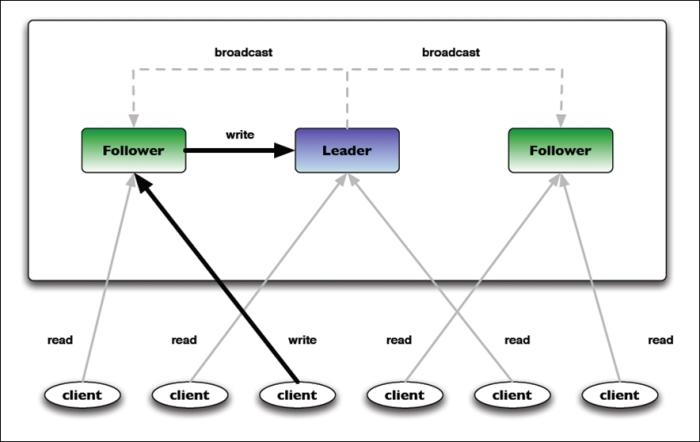

## [原文](https://www.jianshu.com/p/bbacb558371a)

# ZooKeeper 基本操作

ZooKeeper的数据模型及其API支持以下九个基本操作：


操作 | 描述
|---|---
create |在ZooKeeper命名空间的指定路径中创建一个znode
delete | 从ZooKeeper命名空间的指定路径中删除一个znode
exists | 检查路径中是否存在znode
getChildren | 获取znode的子节点列表
getData | 获取与znode相关的数据
setData | 将数据设置/写入znode的数据字段
getACL | 获取znode的访问控制列表（ACL）策略
setACL | 在znode中设置访问控制列表（ACL）策略
sync | 将客户端的znode视图与ZooKeeper同步


我们来使用ZooKeeper Java shell对上面中提到的ZooKeeper操作进行演示：

用ThisIsTheRootNode作为数据创建一个名为root的znode：
```bash
[zk: localhost(CONNECTED) 0] create /root "ThisIsTheRootNode"
Created /root

```

- 获取刚创建的root的znode的内容：

```bash
[zk: localhost(CONNECTED) 1] get /root
"ThisIsTheRootNode"
…… ……
…… ……

```

- 用ThisIsChild-1作为数据为root创建一个名为child-1的子节点：

```bash
[zk: localhost(CONNECTED) 2] create /root/child-1 "ThisIsChild-1"
Created /root/child-1

```

- 用ThisIsChild-2作为数据为root创建一个名为child-2的子节点：

```bash
[zk: localhost(CONNECTED) 3] create /root/child-2 "ThisIsChild-2"
Created /root/child-2

```

- 列出root的子节点：

```bash
[zk: localhost(CONNECTED) 4] ls /root
[child-2, child-1]

```

- 获取root的访问控制列表：


```bash
[zk: localhost(CONNECTED) 5] getAcl /root
'world,'anyone
: cdrwa

```

- 由于root拥有2个子节点，所以不允许删除root：

```bash
[zk: localhost(CONNECTED) 6] delete /root
Node not empty: /root

```

- 删除子节点child-1：

```bash
[zk: localhost(CONNECTED) 7] delete /root/child-1

```

- 删除子节点child-2：

```bash
[zk: localhost(CONNECTED) 8] delete /root/child-2

```

- 列出root的内容：

```bash
[zk: localhost(CONNECTED) 9] ls2 /root
[]
…… ……
…… ……

```

- 删除root：

```bash
[zk: localhost(CONNECTED) 10] delete /root

```

除了上述描述的操作外，ZooKeeper还支持使用称为multi的操作对znodes进行批量更新。 
这将多个原始操作组合在一起成为一个单元。 一个multi操作本质上也是原子的，这意味着要么所有的更新成功，
要么整个更新整个失败。

ZooKeeper不允许部分写入或读取znode数据。 设置znode的数据或读取时，znode的内容将被替换或完全读取。 
ZooKeeper中的更新操作（如delete或setData操作）必须指定正在更新的znode的版本号。 

版本号可以通过使用exists()方法调用来获得。 如果指定的版本号与znode中的版本号不匹配，则更新操作将失败。 
另外，需要注意的另一件重要的事情是ZooKeeper中的更新是非阻塞（non-blocking）操作。

ZooKeeper中的读写操作如下图所示：




ZooKeeper中的读写操作

从前面的图片中，需要注意这些操作两个关键地方：

- Read requests：这些在客户端当前连接的ZooKeeper服务器上进行局部处理   
- Write requests：这些被转发给领导者，并在生成响应之前通过多数协商一致

