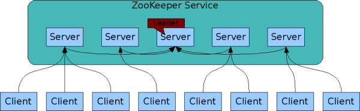
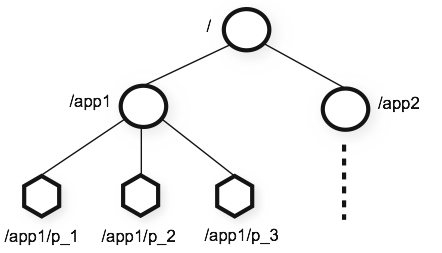

## [原文](https://www.jianshu.com/p/c11eb642c643)

# Zookeeper基础知识点

> Zookeeper 作为 Hadoop 项目中的一个子项目，是 Hadoop 集群管理的一个必不可少的模块，
它主要用来控制集群中的数据，如它管理 Hadoop 集群中的 NameNode，
还有 Hbase 中 Master Election、Server 之间状态同步等

## 1.概念

1. zookeeper是一个类似hdfs的树形文件结构，zookeeper可以用来保证数据在(zk)集群之间的数据的事务性一致。

   - 基于ZAB算法（原子消息广播协议）

   - 保证分布式环境中数据一致性

   - 两个作用：存储数据、监听事件
 

2. zookeeper有watch事件，是一次性触发的，当watch监视的数据发生变化时，通知设置了该watch的client，即watcher。

3. zookeeper有三个角色：Learner，Follower，Observer

## 2.特性

### 2.1可靠性
一旦Zookeeper成功的应用了一个事务，并完成对client的响应，那么Zookeeper内部集群的所有服务器的状态都会是一致的保留下来。

### 2.2单一视图
由于上面可靠性的保证，使得无论client连接的是ZK集群中的哪个服务器，所看到的数据都是一致的。

### 2.3顺序一致性
从一个client发起的请求，最终会严格的按照发起的顺序被应用到Zookeeper中去。【实质上，ZK会对每一个client的每一个请求，
进行编号，说白了，就是分配一个全局唯一的递增编号，这个编号反映了所有事务操作的先后顺序。】

### 2.4实时性
通常意义下的实时性是指一旦事务被成功应用，那么client会立刻从服务器端获取到变更后的新数据。ZK仅仅能够保证在一定时间内，
client最终一定会能从服务器上获取到最新的数据。

### 2.5高可用
在ZK集群内部，会有一个Leader，多个Follower。一旦Leader挂掉，那么ZK会通过Paxos算法选举出新的Leader，
只要ZK集群内部的服务器有一半以上正常工作，那么ZK就能对外正常提供服务！

### 2.6简单的数据结构
类似于Linux文件系统的树形结构，简单，实用！（树形层次空间）

### 2.7高性能
性能有多高呢，举个栗子，比如我们经常通过创建临时节点来处理分布式锁，要知道临时节点是存储在内存中的，
在读场景压力测试下，QPS高达10W+！也就是说ZK在读场景下，性能非常突出！

## 3.zookeeper的Watcher：一次性、客户端串行执行、轻量

### 3.1一次性
对于ZK的watcher，只需要记住：zookeeper有watch事件，是一次性触发的，当watch监视的数据发生变化时，
通知设置了该watch的client，即watcher，由于zookeeper的监控都是 一次性的，所以每次都必须设置监控。

### 3.2客户端串行执行
客户端Watcher回调的过程是一个串行同步的过程，这为我们保证了顺序，开发人员需要注意，
千万不要因为一个Watcher的处理逻辑影响了整个客户端的Watcher回调

### 3.3轻量
WatchedEvent是zookeeper整个Watcher通知机制的最小通知单元，只包含三个部分：通知状态、事件类型、节点路径。
只会告诉客户端发生了事件，不会告知其内容，需要客户端自己去获取，比如NodeDataChanged事件，
Zookeeper只会通知客户端指定节点发生了变更，不会直接提供具体的数据内容

