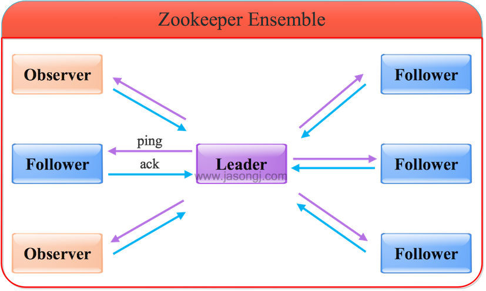
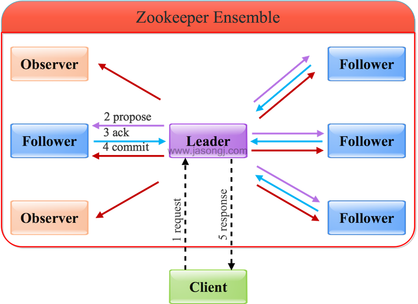
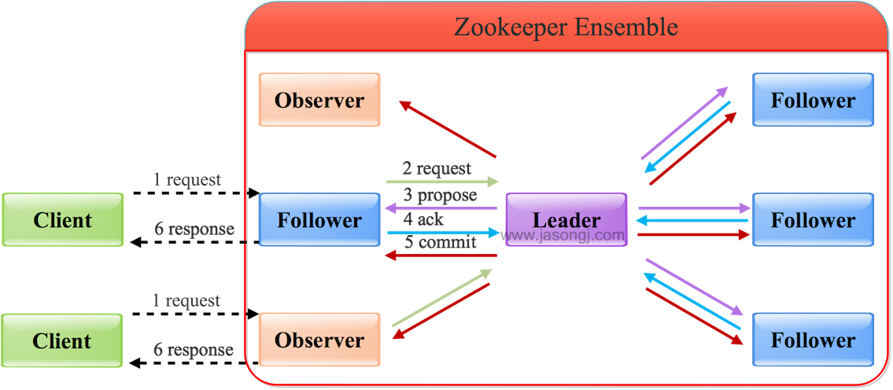

## [深入浅出Zookeeper（一） Zookeeper架构](http://www.jasongj.com/zookeeper/fastleaderelection/)

# Zookeeper架构(Zookeeper Architecture)

## 角色
Zookeeper集群是一个基于主从复制的高可用集群，每个服务器承担如下三种角色中的一种

- Leader 一个Zookeeper集群同一时间只会有一个实际工作的Leader，它会发起并维护与各Follower及Observer间的心跳。
所有的写操作必须要通过Leader完成再由Leader将写操作广播给其它服务器。

- Follower 一个Zookeeper集群可能同时存在多个Follower，它会响应Leader的心跳。
Follower可直接处理并返回客户端的读请求，同时会将写请求转发给Leader处理，并且负责在Leader处理写请求时对请求进行投票。

- Observer 角色与Follower类似，但是无投票权。

## 原子广播（ZAB）
为了保证写操作的一致性与可用性，Zookeeper专门设计了一种名为原子广播（ZAB）的支持崩溃恢复的一致性协议。
基于该协议，Zookeeper实现了一种主从模式的系统架构来保持集群中各个副本之间的数据一致性。

根据ZAB协议，所有的写操作都必须通过Leader完成，Leader写入本地日志后再复制到所有的Follower节点。

一旦Leader节点无法工作，ZAB协议能够自动从Follower节点中重新选出一个合适的替代者，即新的Leader，该过程即为领导选举。
该领导选举过程，是ZAB协议中最为重要和复杂的过程。

## 写操作

### 写Leader
通过Leader进行写操作流程如下图所示

由上图可见，通过Leader进行写操作，主要分为五步：

1. 客户端向Leader发起写请求
2. Leader将写请求以Proposal的形式发给所有Follower并等待ACK
3. Follower收到Leader的Proposal后返回ACK
4. Leader得到过半数的ACK（Leader对自己默认有一个ACK）后向所有的Follower和Observer发送Commit
5. Leader将处理结果返回给客户端

这里要注意

- Leader并不需要得到Observer的ACK，即Observer无投票权

- Leader不需要得到所有Follower的ACK，只要收到过半的ACK即可，同时Leader本身对自己有一个ACK。
上图中有4个Follower，只需其中两个返回ACK即可，因为(2+1) / (4+1) > 1/2

- Observer虽然无投票权，但仍须同步Leader的数据从而在处理读请求时可以返回尽可能新的数据

### 写Follower/Observer
通过Follower/Observer进行写操作流程如下图所示：

从上图可见
- Follower/Observer均可接受写请求，但不能直接处理，而需要将写请求转发给Leader处理
- 除了多了一步请求转发，其它流程与直接写Leader无任何区别

###读操作
Leader/Follower/Observer都可直接处理读请求，从本地内存中读取数据并返回给客户端即可。

由于处理读请求不需要服务器之间的交互，Follower/Observer越多，整体可处理的读请求量越大，也即读性能越好。