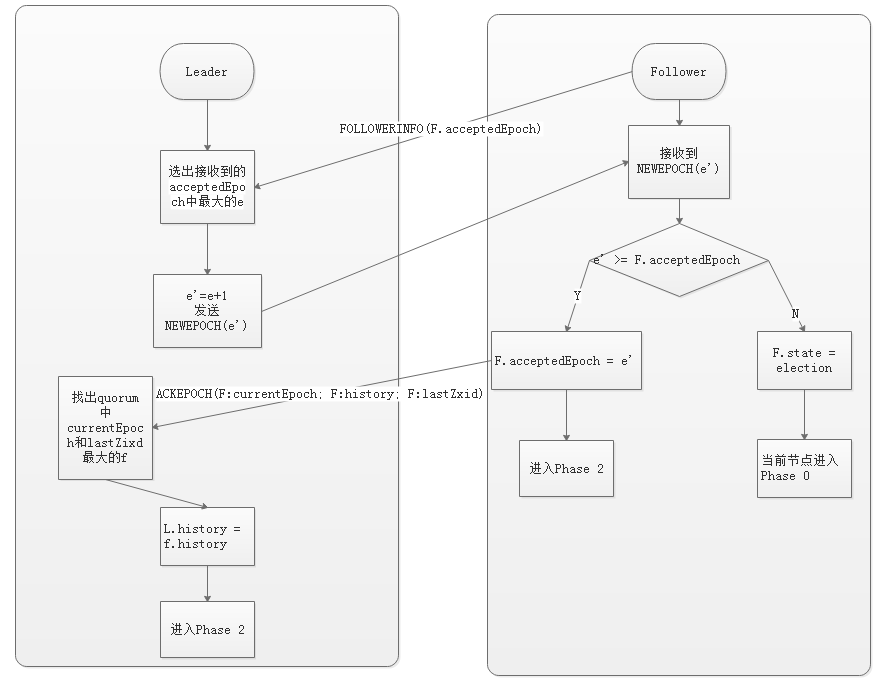
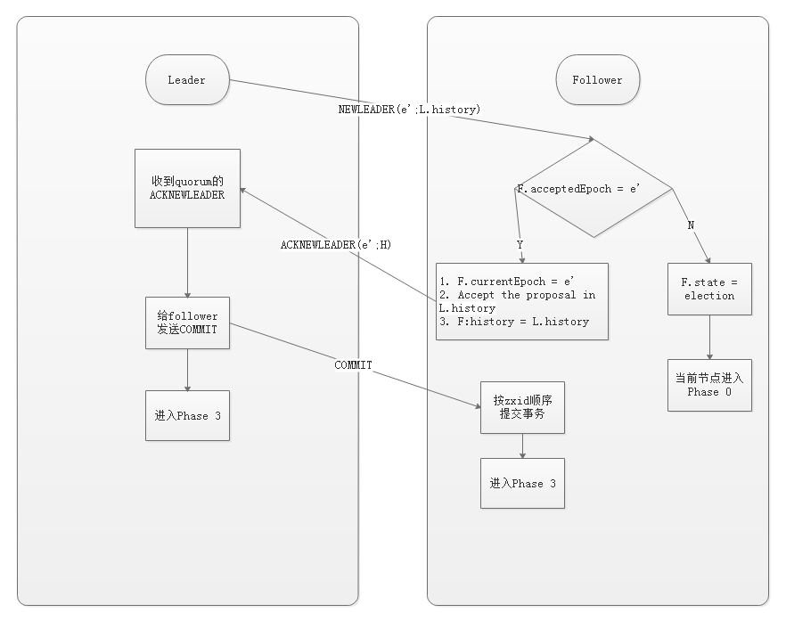
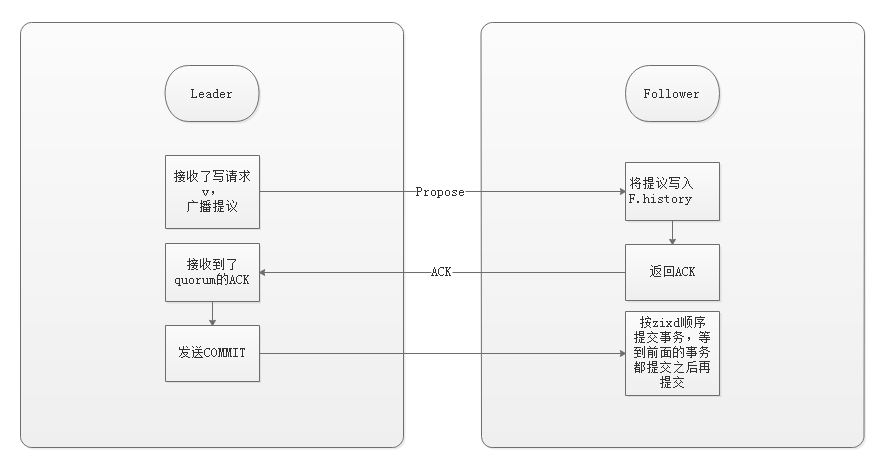
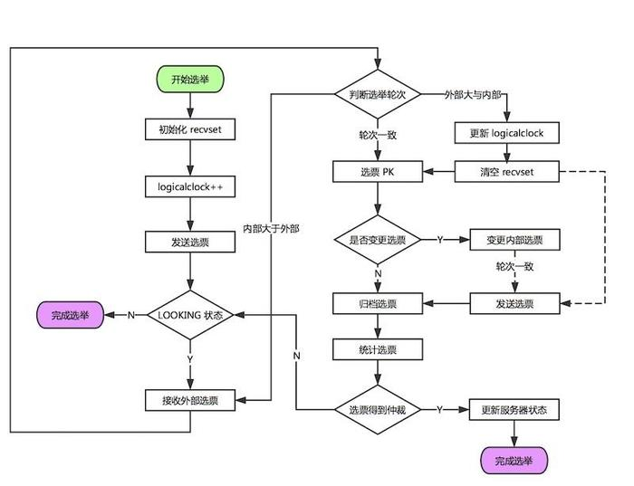
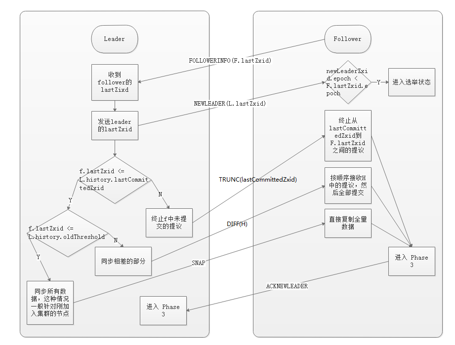

## [原文1](https://www.jianshu.com/p/e689e67d1f7b)

## [原文2](https://www.jianshu.com/p/9f3a9528524f)

# ZooKeeper一致性协议:ZAB协议

## 1. ZAB协议
ZAB协议（Zookeeper Atomic Broadcast Protocol）是Zookeeper系统专门设计的一种`支持崩溃恢复的原子广播协议`。
在 ZooKeeper 中`，主要依赖 ZAB 协议来实现分布式数据一致性`，
基于该协议，ZooKeeper 实现了一种`主备模式的系统架构来保持集群中各个副本之间的数据一致性`。

ZAB协议理论与Zookeeper对该协议的实现还是存在一些差别，本文将针对ZAB的协议本身和Zookeeper的实现两个维度来介绍。

### 1.2 ZAB协议的四阶段

在详细介绍ZAB协议之前，我们先介绍一下ZAB协议中的一些常用术语。

#### 服务器的状态
- Looking：该状态表示集群中不存在群首节点，进入群首选举过程。
- Leading：群首状态，表示该服务器是群首节点。
- Following：跟随者状态，表示该服务器是群首的Follow节点。
注意：服务器默认是Looking状态

#### 节点的持久数据状态
- history: 当前节点接收到的事务提议的log
- acceptedEpoch：follower节点已经接受的leader更改年号的NEWEPOCH提议
- currentEpoch：当前所处的年代
- lastZxid：history中最近接收到的提议的zxid

#### a. 选举阶段
在选举阶段，`只要有节点在集群中超过半数的节点支持，该节点就会被作为准Leader`。
该节点暂不会作为Leader节点来提供服务，能否真正作为Leader节点，还依赖与后续的阶段能否正常完成。

#### b. 发现阶段
在选举出Leader节点后，集群进入发现阶段。Follow与准Leader进行通信，同步集群中各个节点的状态，确认集群中最新提议历史。

ZAB协议发现阶段图

#### c. 同步阶段
在完成发现阶段后，准Leader可以获取集群中最新的提议历史。准Leader在该阶段会把最新的提议历史同步到集群中的所有节点。
当同步完成时，准Leader才会真正成为Leader，执行Leader的工作。

ZAB协议同步阶段图

#### d. 广播阶段
到了该阶段，Zookeeper才能真正对外提供事务服务，leader可以进行消息的广播。

ZAB协议广播阶段图

## 2. Zookeeper的仲裁原则
对于ZAB协议来说，遵循如下的仲裁原则：`少数服从多数`  
深入解读，可以得出如下的几点： 

- 群首选举过程中有超过一半的节点达成一致则选举过程结束。
- 事务的确认同样遵循该原则，只要得到半数以上的支持，则表示事务成功。
- 少数服从多数可以保证集群分裂也存在至少一个公共节点。
- Zookeeper的集群数`配置奇数更为合理`，因为n与n+1的容错是相等的，n这里为奇数。

## 3. Zookeeper对ZAB协议的实现
Java版本对ZAB协议的实现与原理有一定的区别，ZAB的实现只有三个阶段：

- 选举阶段
- 恢复阶段（发现阶段+同步阶段）
- 广播阶段

### 3.1. 选举阶段
服务选举阶段，要求服务器之间两两相交，下面我们详细介绍一下Zookeeper服务器间的连接方式。
首先，每个服务器会`记录本服务器自身的sid`。`sid由服务器的配置文件指定`。
其次，Zookeeper`只允许sid较大的服务器与sid较小的服务器建立连接`。这样可以避免建立多余的连接。

在选举阶段，Zookeeper有不同的算法来实现群首的选举，部分算法已经废弃，这里我们介绍其中的`FastLeaderElection算法`。

群首选举的流程图如下：

群首选举步骤图

选举过程中比较重要的一步是判断是否变更选票，这里的详细判断逻辑如下：

- 优先选择epoch较大
- epoch相等时，优先选择zxid较大的
- epoch和zxid都相等时，选择server id较大的

### 3.2 恢复阶段
该阶段，follower同步自己的最新的zxid给leader，leader来决定如何同步。  
注意:

- 同步事务时，Zookeeper根据oldThreshold来判断是同步相差部分还是全量数据
- 对于leader zxid之后的事务，leader会发送trunc指令来中支

恢复的具体流程如下：

### 3.3 广播阶段
该阶段接收服务并进行事务广播，不做详细介绍。
 

## 总结
经过上面的分析，我们可以来回答开始提到的两个问题

主从架构下，leader 崩溃，数据一致性怎么保证？  
leader 崩溃之后，集群会选出新的 leader，然后就会进入恢复阶段，新的 leader 具有所有已经提交的提议，
因此它会保证让 followers 同步已提交的提议，丢弃未提交的提议（以 leader 的记录为准），
这就保证了整个集群的数据一致性。

选举 leader 的时候，整个集群无法处理写请求的，如何快速进行 leader 选举？    
这是通过 Fast Leader Election 实现的，leader 的选举只需要超过半数的节点投票即可，
这样不需要等待所有节点的选票，能够尽早选出 leader。

 

