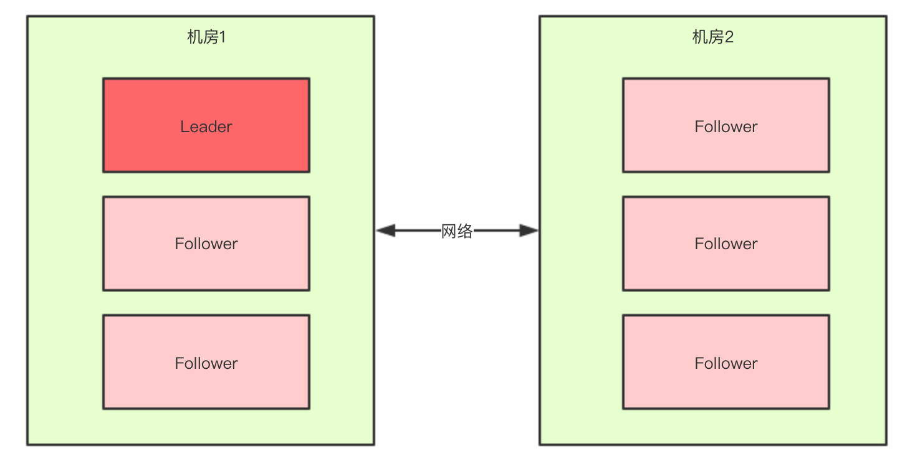
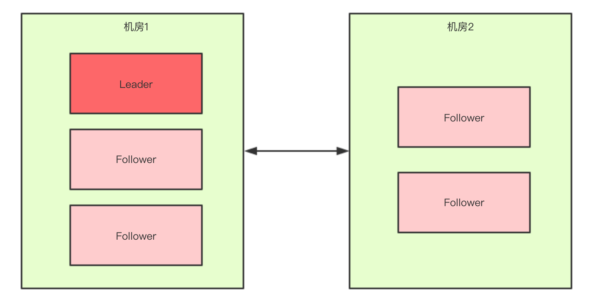

## [原文1](https://blog.csdn.net/yjp198713/article/details/79400927)

## [原文2](https://juejin.im/post/5d36c2f25188257f6a209d37)

# zookeeper脑裂问题

## 什么是脑裂？

脑裂(split-brain)就是“大脑分裂”，也就是本来一个“大脑”被拆分了两个或多个“大脑”，
脑裂通常会出现在`集群环境`中，比如 `ElasticSearch、Zookeeper集群`，而这些集群环境有一个统一的特点，
就是它们有一个大脑，比如ElasticSearch集群中有Master节点，Zookeeper集群中有Leader节点。

- 假死：由于心跳超时（网络原因导致的）认为master死了，但其实master还存活着。
- 脑裂：由于假死会发起新的master选举，选举出一个新的master，但旧的master网络又通了，导致出现了两个master ，
有的客户端连接到老的master 有的客户端链接到新的master。

正常情况下，此集群只会有一个Leader，那么如果机房之间的网络断了之后，
两个机房内的zkServer还是可以相互通信的，`如果不考虑过半机制`，那么就会出现每个机房内部都将选出一个Leader。

这就相当于原本一个集群，被分成了两个集群，出现了两个“大脑”，这就是脑裂。
 
## 什么原因导致的？
主要原因是Zookeeper集群和Zookeeper client`判断超时`并`不能做到完全同步`，也就是说可能一前一后，
如果是集群先于client发现，那就会出现上面的情况。同时，在发现并切换后通知各个客户端也有先后快慢。
一般出现这种情况的几率很小，需要master与Zookeeper集群网络断开但是与其他集群角色之间的网络没有问题，
还要满足上面那些情况，但是一旦出现就会引起很严重的后果，数据不一致。

## zookeeper是如何解决的？
要解决Split-Brain的问题，一般有3种方式:

- Quorums（ˈkwôrəm 法定人数） ，比如3个节点的集群，Quorums = 2, 也就是说集群可以容忍1个节点失效，
这时候还能选举出1个lead，集群还可用。比如4个节点的集群，它的Quorums = 3，Quorums要超过3，
相当于集群的容忍度还是1，如果2个节点失效，那么整个集群还是无效的

- 采用Redundant communications，冗余通信的方式，集群中采用多种通信方式，
防止一种通信方式失效导致集群中的节点无法通信。

- Fencing, `共享资源的方式`，比如能看到共享资源就表示在集群中，能够获得共享资源的锁的就是Leader，看不到共享资源的，就不在集群中。

`ZooKeeper默认采用了Quorums`这种方式，即只有集群中超过半数节点投票才能选举出Leader。
这样的方式可以确保leader的唯一性,要么选出唯一的一个leader,要么选举失败。在ZooKeeper中Quorums有2个作用：

- 集群中最少的节点数用来选举Leader保证集群可用
- 通知客户端数据已经安全保存前集群中最少数量的节点数已经保存了该数据。一旦这些节点保存了该数据，
客户端将被通知已经安全保存了，可以继续其他任务。而集群中剩余的节点将会最终也保存了该数据

## 选举的过程中为什么一定要有一个过半机制验证？过半机制中为什么是大于，而不是大于等于呢？

举个简单的例子：  
如果现在集群中有5台zkServer，那么`half=5/2=2`，那么也就是说，领导者选举的过程中至少要有三台zkServer投了同一个zkServer，
才会符合过半机制，才能选出来一个Leader。  

那么有一个问题我们想一下，`选举的过程中为什么一定要有一个过半机制验证`？

因为这样不需要等待所有zkServer都投了同一个zkServer就可以选举出来一个Leader了，这样`比较快`，所以叫`快速领导者选举算法`。

那么再来想一个问题，`过半机制中为什么是大于，而不是大于等于呢`？
这就是更脑裂问题有关系了，比如回到上文出现脑裂问题的场景：

如果假设我们现在只有5台机器，也部署在两个机房：

此时过半机制的条件是 集群.size() > 2，也就是`至少要3台服务器才能选出一个Leader`，此时机房件的网络断开了，
对于机房1来说是没有影响的，Leader依然还是Leader，对于机房2来说是选不出来Leader的，此时整个集群中只有一个Leader。

所以，我们可以总结得出，有了过半机制，对于一个Zookeeper集群，要么没有Leader，要没只有1个Leader，这样就避免了脑裂问题。

 