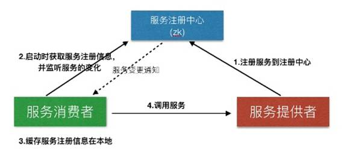
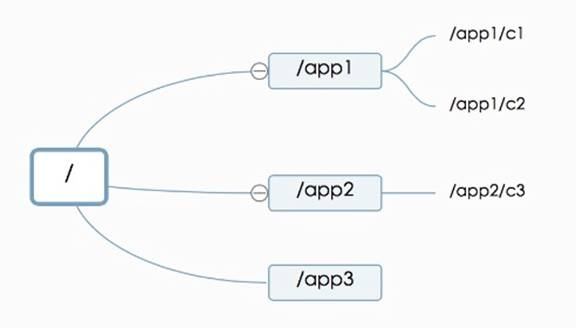
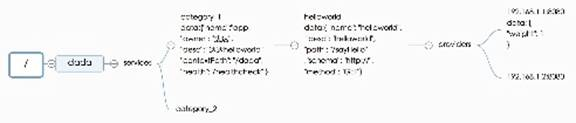
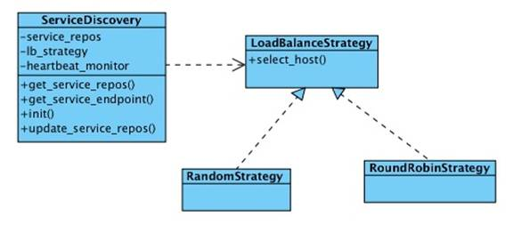

## [原文](https://my.oschina.net/jiangzhixiong/blog/596503)

# Zookeeper的服务发现与注册原理解析

Zookeeper是什么?按照Apache官网的描述是：

ZooKeeper is a centralized service for maintaining configuration information, naming,
 providing distributed synchronization, and providing group services.

参照官网的定义，它能够做：

1. 作为配置信息的存储的中心服务器

2. 命名服务

3. 分布式的协调

4. Mater选举等

在定义中特别提到了命名服务。在调研之后，Zookeeper作为服务注册与发现的解决方案，它有如下优点：

1. 它提供的简单API

2. 已有互联网公司(例如：Pinterest，Airbnb)使用它来进行服务注册与发现

3. 支持多语言的客户端

4. 通过Watcher机制实现Push模型，服务注册信息的变更能够及时通知服务消费方

缺点是：

1. 引入新的Zookeeper组件，带来新的复杂性和运维问题

2. 需自己通过它提供的API来实现服务注册与发现逻辑(包含Python与Java版本)

我们对上述几个方案的优缺点权衡之后，决定采用了基于Zookeeper实现自己的服务注册与发现。

## 基于Zookeeper的服务注册与发现架构

在此架构中有三类角色：服务提供者，服务注册中心，服务消费者。

### 服务提供者

服务提供者作为服务的提供方将自身的服务信息注册到服务注册中心中。服务信息包含：

▪ 隶属于哪个系统

▪ 服务的IP，端口

▪ 服务的请求URL

▪ 服务的权重等等

服务注册中心

服务注册中心主要提供所有服务注册信息的中心存储，同时负责将服务注册信息的更新通知实时的Push给服务消费者(主要是通过Zookeeper的Watcher机制来实现的)。

### 服务消费者

服务消费者主要职责如下：

1. 服务消费者在启动时从服务注册中心获取需要的服务注册信息

2. 将服务注册信息缓存在本地

3. 监听服务注册信息的变更，如接收到服务注册中心的服务变更通知，则在本地缓存中更新服务的注册信息

4. 根据本地缓存中的服务注册信息构建服务调用请求，并根据负载均衡策略(随机负载均衡，Round-Robin负载均衡等)来转发请求

5. 对服务提供方的存活进行检测，如果出现服务不可用的服务提供方，将从本地缓存中剔除

服务消费者只在自己初始化以及服务变更时会依赖服务注册中心，在此阶段的单点故障通过Zookeeper集群来进行保障。
在整个服务调用过程中，服务消费者不依赖于任何第三方服务。

## 实现机制介绍

### Zookeeper数据模型介绍

在整个服务注册与发现的设计中，最重要是如何来存储服务的注册信息。

在设计基于Zookeeper的服务注册结构之前，我们先来看一下Zookeeper的数据模型。Zookeeper的数据模型如下图所示：

Zookeeper数据模型结构与Unix文件系统很类似，是一个树状层次结构。每个节点叫做Znode，节点可以拥有子节点，
同时允许将少量数据存储在该节点下。客户端可以通过监听节点的数据变更和子节点变更来实时获取Znode的变更(Wather机制)。

### 服务注册结构

服务注册结构如上图所示。

▪ /dada来标示公司名称dada，同时能方便与其它应用的目录区分开(例如：Kafka的brokers注册信息放置在/brokers下)

▪ /dada/services将所有服务提供者都放置该目录下

▪ /dada/services/category1目录定义具体的服务提供者的id：category1，
同时该Znode节点中允许存放该服务提供者的一些元数据信息，
例如：名称，服务提供者的Owner，上下文路径(Java Web项目),健康检查路径等。该信息可以根据实际需要进行自由扩展。

▪ /dada/services/category1/helloworld节点定义了服务提供者category1下的一个服务：helloworld。
其中helloworld为该服务的ID，同时允许将该服务的元数据信息存储在该Znode下，
例如图中标示的：服务名称，服务描述，服务路径，服务的调用的schema，服务的调用的HTTP METHOD等。
该信息可以根据实际需要进行自由扩展。

▪ /dada/services/category1/helloworld/providers节点定义了服务提供者的父节点。
在这里其实可以将服务提供者的IP和端口直接放置在helloworld节点下，在这里单独放一个节点，
是为了将来可以将服务消费者的消息挂载在helloworld节点下，进行一些扩展，
例如命名为：/dada/services/category1/helloworld/consumers。

▪ /dada/services/category__1/helloworld/providers/192.168.1.1:8080该节点定义了服务提供者的IP和端口，
同时在节点中定义了该服务提供者的权重。

## 下面着重介绍一下服务发现是如何工作的：

在上述类图中，类ServiceDiscovery主要通过Zookeeper的API(Python/Java版本)来获取服务信息，
同时对服务注册结构中的每个服务的providers节点增加Watcher，来监控节点变化。
获取的服务注册信息保存在变量service_repos中。
通过在初始化时设置LoadBalanceStrategy的实现(Round-Robin算法，Radmon算法)来实现服务提供者的负载均衡。主要方法:

1. init获取Zookeeper的服务注册信息，并缓存在service_repos

2. get_service_repos方法获取实例变量service_repos

3. get_service_endpoint根据init构建好的service_repos，以及lb_strategy提供的负载均衡策略返回某个服务的URL地址

4. update_service_repos通过Zookeeper的Watcher机制来实时更新本地缓存service_repos

5. heartbeat_monitor是一个心跳检测线程，用来进行服务提供者的健康存活检测，如果出现问题，将该服务提供者从该服务的提供者列表中移除;反之，则加入到服务的提供者列表中

LoadBalanceStrategy定义了根据服务提供者的信息返回对应的服务Host和IP，即决定由那台主机+端口来提供服务。

RoundRobinStrategy和RandomStrategy分别实现了Round-Robin和随机的负载均衡算法

