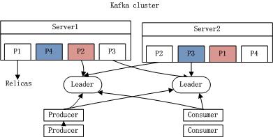

## [原文](https://www.iteye.com/blog/shift-alt-ctrl-1930345)

# Kafka基本知识点-入门

## 1.1 简介

Kafka是一个"分布式的"/"可分区的(partitioned)"/"基于备份的(replicated)"/"基于commit-log存储"的服务. 
它提供了类似于JMS的特性,但是在设计实现上完全不同,此外它并不是JMS规范的实现.

kafka消息是根据Topic进行归类,发送消息者成为Producer,消息接收者成为Consumer;   
此外kafka集群有多个kafka实例组成,每个实例(server)称为broker.

无论是kafka集群,还是producer和consumer都依赖于zookeeper来保证系统可用性以及保存一些meta信息.

(摘自官网) 

其中`client与server的通讯,都是基于TCP,而且消息协议非常轻量级`.

### Topics/logs

一个Topic可以认为是一类消息,每个topic将被分成多个partition(区),每个partition在存储层面是append log文件.  
任何发布到此partition的消息都会直接追加到log文件的尾部,每条消息在文件中的位置称为offset(偏移量),  
offset为一个long型数字,它唯一的标记一条消息.kafka并没有提供其他额外的索引机制来存储offset,
因为在kafka中几乎不允许对消息进行"随机读-写",一旦消息写入log日志之后,将不能被修改.

(摘自官网) 

kafka和JMS实现(activeMQ)不同的是:即使消息被消费,消息仍然不会被立即删除.   
日志文件将会根据broker中的配置要求,保留一定的时间之后删除;比如log文件保留2天,那么两天后,文件会被清除,无论其中的消息是否被消费.   
kafka通过这种简单的手段,来释放磁盘空间.   
此外,kafka的性能并不会因为日志文件的太多而低下,所以即使保留较多的log文件,也不不会有问题.

对于consumer而言,它需要保存消费消息的offset,对于offset的保存和使用,由consumer来控制;
当consumer正常消费消息时,offset将会"线性"的向前驱动,即消息将依次顺序被消费.事实上consumer可以使用任意顺序消费消息,  
它只需要将offset重置为任意值..(offset将会保存在zookeeper中,参见下文)

kafka集群几乎不需要维护任何consumer和producer状态信息,这些信息有zookeeper保存;   
因此producer和consumer的客户端实现非常轻量级,它们可以随意离开,而不会对集群造成额外的影响.

partitions的设计目的有多个.最根本原因是kafka基于文件存储.   
通过分区,可以将日志内容分散到多个server上,来避免文件尺寸达到单机磁盘的上限,每个partition都会被当前server(kafka实例)保存;  
可以将一个topic切分多任意多个partitions(备注:基于sharding),来消息保存/消费的效率.
此外越多的partitions意味着可以容纳更多的consumer,有效提升并发消费的能力.(具体原理参见下文).

### Distribution(分布、分配)

一个Topic的多个partitions,被分布在kafka集群中的多个server上;   
每个server(kafka实例)负责partitions中消息的读写操作;   
此外kafka还可以配置每个partition需要备份的个数(replicas),每个partition将会被备份到多台机器上,以提高可用性.[replicas特性在0.8V才支持]

基于replicated方案,那么就意味着需要对多个备份进行调度;一个partition可以在多个server上备份,   
那么其中一个server作为此partition的leader;   
leader负责此partition所有的读写操作,如果leader失效,那么将会有其他follower来接管(成为新的leader);   
follower只是单调的和leader跟进,同步消息即可..由此可见作为leader的server承载了全部的请求压力,   
因此从集群的整体考虑,有多少个partitions就意味着有多少个"leader",kafka会将"leader"均衡的分散在每个实例上,
来确保整体的性能稳定.[备注:kafka中将leader角色权限下放到partition这个层级]

 

### Producers(生产者)

Producer将消息发布到指定的Topic中,同时Producer也能决定将此消息发送到哪个partition;   
如果一个Topic有多个partitions时,你需要选择partition的算法（由producer决定）,比如基于"round-robin（轮询调度算法）"方式或者通过其他的一些算法等.
无论如何选择partition路由算法,我们最直接的目的就是希望消息能够均匀的发送给每个partition,这样可以让consumer消费的消息量也能"均衡".

### Consumers(消费者)

本质上kafka只支持Topic.每个consumer属于一个consumer group;  
反过来说,每个group中可以有多个consumer.   
对于Topic中的一条特定的消息,只会被订阅此Topic的每个group中的一个consumer消费,此消息不会发送给一个group的多个consumer;
那么一个group中所有的consumer将会交错的消费整个Topic.

如果所有的consumer都具有相同的group,这种情况和JMS queue模式很像;消息将会在consumers之间负载均衡.

如果所有的consumer都具有不同的group,那这就是"发布-订阅";消息将会广播给所有的消费者.

(摘自官网) 

在kafka中,一个partition中的消息只会被group中的一个consumer消费(同一时刻);   
每个group中consumer消息消费互相独立;   
我们可以认为一个group是一个"订阅"者,一个Topic中的每个partitions,只会被一个"订阅者"中的一个consumer消费,  
不过一个consumer可以同时消费多个partitions中的消息.   
kafka只能保证一个partition中的消息被某个consumer消费时是顺序的.  
事实上,从Topic角度来说,当有多个partitions时,消息仍不是全局有序的.

通常情况下,一个group中会包含多个consumer,这样不仅可以提高topic中消息的并发消费能力,而且还能提高"故障容错"性,
如果group中的某个consumer失效,那么其消费的partitions将会有其他consumer自动接管.

kafka的设计原理决定,对于一个topic,同一个group中不能有多于partitions个数的consumer同时消费,否则将意味着某些consumer将无法得到消息.

### Guarantees(保障)

1) 发送到partitions中的消息将会按照它接收的顺序追加到日志中,无论一个partition由多少个log文件构成,那么它发送给consumer的顺序是一定的.

2) 对于消费者而言,它们消费消息的顺序和日志中消息顺序一致.

3) 如果Topic的"replication factor"为N,那么允许N-1个kafka实例失效.只要有一个replication存活,那么此partition的读写操作都不会中断.

 

## 1.2 Use cases

### Messaging(消息)

和一些常规的消息系统相比,kafka仍然是个不错的选择;它具备partitions/replication和容错,可以使kafka具有良好的扩展性和性能优势.  
不过到目前为止,我们应该很清楚认识到,kafka并没有提供JMS中的"事务性""消息传输担保(消息确认机制)""消息分组"等企业级特性;  
kafka只能使用作为"常规"的消息系统,在一定程度上,尚未确保消息的发送与接收绝对可靠(比如,消息重发,消息发送丢失等)

### Website activity tracking

kafka可以作为"网站活性跟踪"的最佳工具;可以将网页/用户操作等信息发送到kafka中.并实时监控,或者离线统计分析等.

### Log Aggregation

kafka的特性决定它非常适合作为"日志收集中心";application可以将操作日志"批量""异步"的发送到kafka集群中,而不是保存在本地或者DB中;
kafka可以批量提交消息/压缩消息等,这对producer端而言,几乎感觉不到性能的开支.此时consumer端可以使hadoop等其他系统化的存储和分析系统.