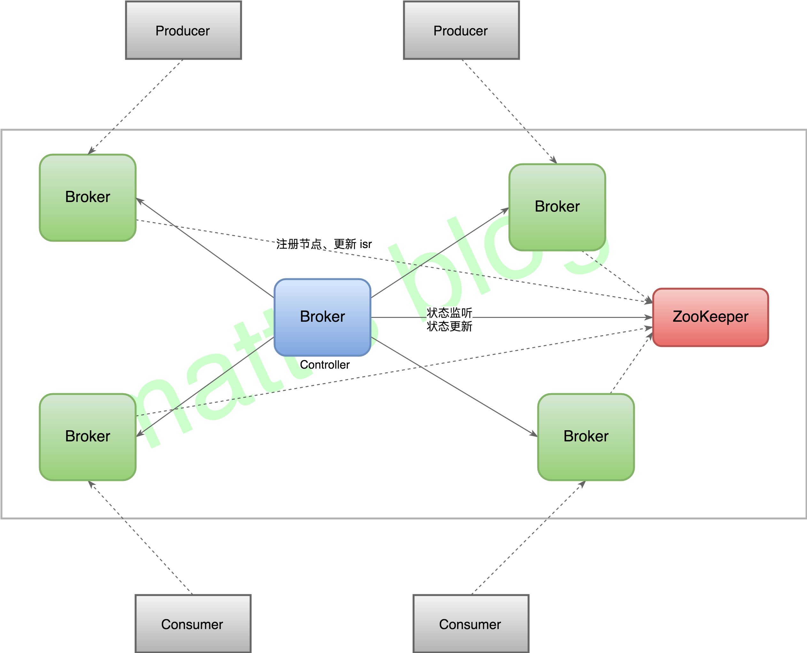

## [原文](https://matt33.com/2018/06/15/kafka-controller-start/)

# Kafka controller 的简介

`所有broker中选出一个controller的选举方式是：先到先得`

## 简介
在于分布式系统中，总会有一个地方需要对`全局 meta 做一个统一的维护`，
Kafka 的 Controller 就是充当这个角色的。Kafka 简单的框架图如下所示

Kafka架构简图

`Controller 是运行在 Broker 上的`，任何一台 Broker 都可以作为 Controller，
但是`一个集群同时只能存在一个 Controller`，也就意味着 `Controller 与数据节点`是在一起的，
Controller 做的主要事情如下：

- Broker 的上线、下线处理；
- 新创建的 topic 或已有 topic 的分区扩容，处理分区副本的分配、leader 选举；
- 管理所有副本的状态机和分区的状态机，处理状态机的变化事件；
- topic 删除、副本迁移、leader 切换等处理。

## 控制器(controller)创建 / 控制器启动顺序

在Kafka集群中，每个Broker在启动时会实例化一个KafkaController类。该类会执行一系列业务逻辑，
选举出主题分区的Leader节点，步骤如下：

- `第一个启动的代理节点，会在Zookeeper系统里面创建一个临时节点/controller`，并写入该节点的注册信息，使`该节点成为控制器`；
> Kafka的Leader选举是通过在zookeeper上创建/controller临时节点来实现leader选举，并在该节点中写入当前broker的信息 
  {“version”:1,”brokerid”:1,”timestamp”:”1512018424988”} 

- 其他的代理节点陆续启动时，也会尝试在Zookeeper系统中创建/controller节点，但是由于/controller节点已经存在，
所以会抛出“创建/controller节点失败异常”的信息。创建失败的代理节点会根据返回的结果，
判断出在Kafka集群中已经有一个控制器被成功创建了，所以放弃创建/controller节点，这样就确保了Kafka集群控制器的唯一性；

- 其他的代理节点，会`在控制器上注册相应的监听器`，各个`监听器负责监听各自代理节点`的状态变化。
当监听到节点状态发生变化时，会触发相应的监听函数进行处理。

