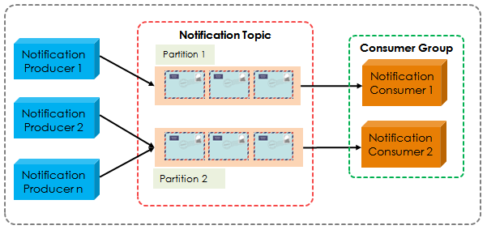
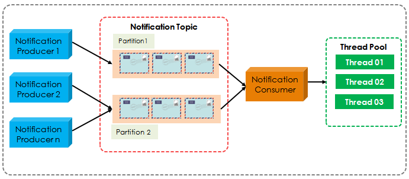

## [kafka 多线程消费](https://www.cnblogs.com/liuwei6/p/6905016.html)

## [原文1](https://chengchaos.github.io/2019/04/03/multi-threaded-kafka-consumer.html)

## [原文2](http://zhongmingmao.me/2019/09/08/kafka-multi-thread-consumer/)

# Kafka 多线程消费者

- KafkaConsumer是线程不安全的
- 不能多线程共享一个KafkaConsumer实例，否则会抛出ConcurrentModificationException
- 但KafkaConsumer.wakeup()是线程安全的

## Kafka Java Consumer设计
Kafka Java Consumer采用的是单线程的设计。其入口类KafkaConsumer是一个双线程的设计，即用户主线程和心跳线程。
用户主线程，指的是启动Consumer应用程序main方法的线程，
新引入的心跳线程（Heartbeat Thread）只负责定期给对应的Broker机器发送心跳请求，以表示消费者应用的存活性

## Kafka Java Consumer设计原理

- Kafka Java Consumer从Kafka 0.10.1.0开始，`KafkaConsumer变成了双线程设计，即用户主线程和心跳线程`
  - 用户主线程：启动Consumer应用程序main方法的那个线程
  - 心跳线程：只负责定期给对应的Broker机器发送心跳请求，以标识消费者应用的存活性
  
- 引入心跳线程的另一个目的
  - 将心跳频率和主线程调用KafkaConsumer.poll方法的频率分开，`解耦`真实的消息处理逻辑和消费组成员存活性管理

- 虽然有了心跳线程，但实际的消息获取逻辑依然是在用户主线程中完成
  - 因此在消费消息的这个层面，依然可以安全地认为KafkaConsumer是单线程的设计
  
- 老版本Consumer是多线程的架构
  - 每个Consumer实例在内部为所有订阅的主题分区创建对应的消息获取线程，即Fetcher线程
  
- 老版本Consumer同时也是阻塞式的，Consumer实例启动后，内部会创建很多阻塞式的消息获取迭代器
  - 但在很多场景下，Consumer端有非阻塞需求，如在流处理应用中执行过滤、分组等操作就不能是阻塞式的
  - 基于这个原因，社区为新版本Consumer设计了单线程+轮询的机制，该机制能较好地实现非阻塞的消息获取

- 单线程的设计简化了Consumer端的设计
  - Consumer获取到消息后，处理消息的逻辑是否采用多线程，完全由使用者决定

- 不论使用哪一种编程语言，单线程的设计都比较容易实现
  - 并不是所有的编程语言都能很好地支持多线程，而单线程设计的Consumer更容易移植到其他语言上

## 多线程消费 Kafka 模型

有两个可能的模型.

- 多个消费者 + 多线程, 每个消费者都拥有自己的线程
- 单个消费者 + 多个任务处理线程

这两个模式都有各自的优缺点:

### 多个消费者 + 多线程

优点	
- 易于实现	
- 在每个分区上实现有序处理更容易

缺点
- 消费者数量受限于主题的分区数量, 超过分区数量的消费者可能不工作
- 会有多个 TCP 连接到 brokers 上

### 单个消费者 + 多个工作处理线程

优点
- 可灵活调整任务线程的数量

缺点
- 实现难度大，因为要分别管理两组线程
- 消息获取和消息处理解耦，`无法保证分区内的消费顺序`
- 两组线程，使得整个消息消费链路被拉长，最终导致正确位移提交会变得异常困难，可能会出现消息的重复消费

