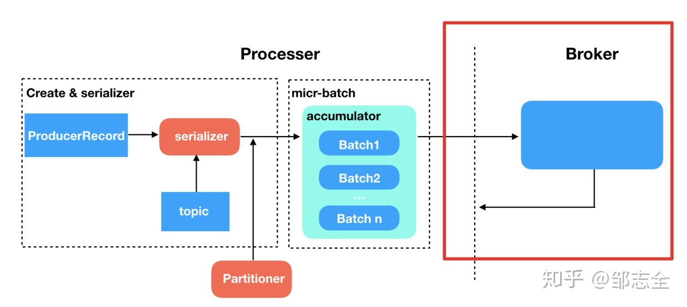

## [原文](https://mp.weixin.qq.com/s/YjQWMvS0lxFQu1SF2KQquw)

# Kafka “不丢消息” ISR 机制解析
 
 
许多消息都会各种保证自己的产品不会丢消息或者消息丢失概率较小，但是靠谱的很少，而且消息队列丢消息排查起来是非常麻烦的，
所以大多数在使用的过程中都会在上层或者下层建立一种消息核对或者应对丢失的策略。
在丢消息这方面，Kafka 算是有着不小的优势，只要去正确使用，Kafka 基本是不会产生丢失的，并且能做到精确一次处理。

Kafka 交付语义、producer中都提到了消息提交给broker中，基本就不会丢消息了，
而这个不丢消息主要是依赖于broker 中的ISR机制。

首先Kafka 消息在broker的存储形式是以log的形式存在的，
打开Kafka的存储的文件夹时就能发现有.log .index .timeindex 三类文件，
其中index、timeindex是索引文件，而.log就是具体的消息的存储文件。
不同的文件存在于不同的分区，这个是由分区选择器确定的。
按照常识，要想保证高可用保证不丢失，最直观的就是制造冗余，多做备份，数据互备嘛，Kafka 也是这么去做的。

在Kafka 中备份日志文件被称为replica，   
replica 又分为leader replica 和follower replica，   
而follower replica存在的唯一目的就是防止消息丢失，并不参与具体的业务逻辑的交互。   
只有leader 才参与服务，follower的作用就是充当leader的候补，平时的操作也只有信息同步。   
ISR （in-sync replica）也就是这组与leader保持同步的replica集合，我们要保证不丢消息，
首先要保证ISR的存活（至少有一个备份存活），并且消息提交成功。   
那存活的概念是什么呢，就是说不仅需要机器正常，还需要跟上leader的消息进度，当达到一定程度的时候就会认为“非存活”状态。

## ISR
broker offset 大致分为：base offset、high watemark（HW）、log end offset（LEO）这个几个概念非常重要，
要是搞不清的话，后面的内容基本上就乱了。

base offset：起始位移，replica中第一天消息的offset

HW：replica高水印值，副本中最新一条已提交消息的位移。
leader 的HW值也就是实际已提交消息的范围，每个replica都有HW值，但仅仅leader中的HW才能作为标示信息。
什么意思呢，就是说当按照参数标准成功完成消息备份（成功同步给follower replica后）才会更新HW的值，
代表消息理论上已经不会丢失，可以认为“已提交”。

LEO：日志末端位移，也就是replica中下一条待写入消息的offset，
注意哈，是下一条并且是待写入的，并不是最后一条。这个LEO个人感觉也就是用来标示follower的同步进度的。

现在就来看一下之前，broker从收到消息到返回响应这个黑盒子里发生了什么。

1、broker 收到producer的请求   
2、leader 收到消息，并成功写入，LEO 值+1   
3、broker 将消息推给follower replica，follower 成功写入 LEO +1 …   
4、所有LEO 写入后，leader HW +1    
5、消息可被消费，并成功响应

这里具体需要同步完成的follower的数量是由acks参数来确定的，
当设定为1的时候仅需要同步给一个follower即可，如果为-1（all），则需要同步所有的follower，   
如果为0的话就代表不需要同步给follower，记下消息之后立马返回，这样的吞吐量是最好的，
但是对消息的也就不能保证丢了，其实常规环境对消息丢失要求没有那么严苛的环境还是可以使用的。
常规使用最多的环境应该是设置为1，同步一份就ok了。

ISR（in sync replica）的含义是同步的replica，相对的就有out of sync replica，
也就是跟不上同步节奏的replica，现在面临的有两个问题，
当replica 跟不上进度时该怎么处理（或原本跟不上节奏的现在又跟上节奏了该如何处理）、如何去判定跟不跟得上节奏。

第一个问题很简单，跟上节奏就加入ISR，跟不上节奏就踢出ISR。

## 关键是如何判定：

在0.9.0.0之前，Kafka提供了replica lag.max.messages 来控制follower副本最多落后leader副本的消息数量，
follower 相对于leader 落后当超过这个数量的时候就判定该follower是失效的，就会踢出ISR，
这里的指的是具体的LEO值。

### 常见的导致同步跟不上的原因主要是下面几个：

1、新的副本（这是很常见的情况，每个新的副本加入都需要一段信息同步的追赶时期）   
 
2、网络IO等原因，某些机器IO处理速度变慢所导致持续消费落后。    

3、进程卡住（Kafka 是Java 写出来的，Java 进程最容易卡住的问题是不是亲切，就是Full GC，及高频次GC）

对应的Kafka 也针对这些场景提供了一些控制的参数：前面提到的replica.lag.max.message（以数量为标准衡量是否落后），
还有以时间为衡量标准的replica.lag.time.max（多久没有向leader 请求数据）

这些是0.9.0.0之前的版本，这个实现是可以适应大多数环境的，但是存在一个严重的缺陷，当qps持续上升，
请求打满之后，很容易造成同步速率下降或者长时间无响应，进而导致很多follower被踢出ISR（在流量高峰时期会挺常见），
这就导致使用者需要在不同的场景定制不同的参数配置，但是什么时候有突发流量什么时候去配置并且令其生效，
这个事儿不现实，所以说Kafka这一点算是一个缺陷吧。

0.9.0.0 之后提供了一个更加适合的方式来解决这个问题，采用Kafka 落后于消费进度的时间长度来判断是否踢出ISR，
这样有效的避免了在突发流量偶然落后于leader 被不合理的踢出ISR的情况，
如果长时间落后于leader 这种情况实际故障是需要去踢的也没问题，
也就有效的避免了ISR的反复移进移出所带来的代价。

 
 
 
 
 
 