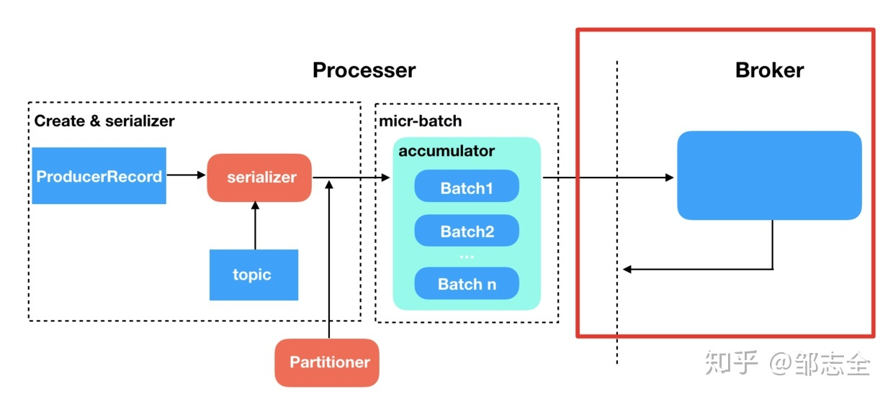
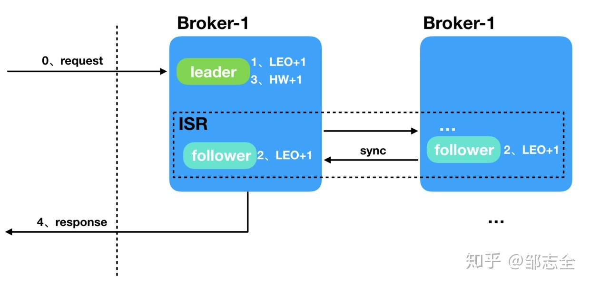

## [原文](https://juejin.im/post/5c46e729e51d452c8e6d5679#heading-6)

# kafka-如何保证消息的可靠性与一致性

> 在kafka中主要通过ISR机制来保证消息的可靠性。
下面通过几个问题来说明kafka如何来保证消息可靠性与一致性

## 在kafka中ISR是什么？
在zk中会保存AR（Assigned Replicas）列表，其中包含了分区所有的副本，其中 AR = ISR+OSR

- ISR（in sync replica）：是kafka动态维护的一组同步副本，在ISR中有成员存活时，
只有这个组的成员才可以成为leader，内部保存的为每次提交信息时必须同步的副本（acks = all时），
每当leader挂掉时，在ISR集合中选举出一个follower作为leader提供服务，当ISR中的副本被认为坏掉的时候，会被踢出ISR，
当重新跟上leader的消息数据时，重新进入ISR。

- OSR（out sync replica）: 保存的副本不必保证必须同步完成才进行确认，OSR内的副本是否同步了leader的数据，
不影响数据的提交，OSR内的follower尽力的去同步leader，可能数据版本会落后。

## kafka如何控制需要同步多少副本才可以返回确定到生产者消息才可用？

- 当写入到kakfa时，生产者可以选择是否等待 
  - 0（只需写入leader） 
  - 1（只需同步一个副本）
  - -1（全部副本）的消息确认（这里的副本指的是ISR中的副本）。

- 需要注意的是“所有副本确认”并不能保证全部分配副本已收到消息。
默认情况下，当acks=all时，只要当前所有在同步中的副本（ISR中的副本）收到消息，就会进行确认。
所以Kafka的交付承诺可以这样理解：对没有提交成功的消息不做任何交付保证，
而对于ISR中至少有一个存活的完全同步的副本的情况下的“成功提交”的消息保证不会丢失。

## 对于kafka节点活着的条件是什么？

- 第一点：一个节点必须维持和zk的会话，通过zk的心跳检测实现

- 第二点：如果节点是一个slave也就是复制节点，那么他必须复制leader节点不能太落后。这里的落后可以指两种情况

  - 1：数据复制落后，slave节点和leader节点的数据相差较大，这种情况有一个缺点，
  在生产者突然发送大量消息导致网络堵塞后，大量的slav复制受阻，导致数据复制落后被大量的踢出ISR。
  
  - 2：时间相差过大，指的是slave向leader请求复制的时间距离上次请求相隔时间过大。
 通过配置replica.lag.time.max就可以配置这个时间参数。这种方式解决了上述第一种方式导致的问题。

## kafka分区partition挂掉之后如何恢复？
在kafka中有一个partition recovery机制用于恢复挂掉的partition。

每个Partition会在磁盘记录一个RecoveryPoint（恢复点）, 记录已经flush到磁盘的最大offset。
当broker fail 重启时,会进行loadLogs。 
首先会读取该Partition的RecoveryPoint,找到包含RecoveryPoint点上的segment及以后的segment, 
这些segment就是可能没有完全flush到磁盘segments。
然后调用segment的recover,重新读取各个segment的msg,并重建索引。

#### 优点：

- 以segment为单位管理Partition数据,方便数据生命周期的管理,删除过期数据简单
- 在程序崩溃重启时,加快recovery速度,只需恢复未完全flush到磁盘的segment即可

## 什么原因导致副本与leader不同步的呢？
- 慢副本：在一定周期时间内follower不能追赶上leader。
最常见的原因之一是I / O瓶颈导致follower追加复制消息速度慢于从leader拉取速度。

- 卡住副本：在一定周期时间内follower停止从leader拉取请求。
follower replica卡住了是由于GC暂停或follower失效或死亡。

- 新启动副本：当用户给主题增加副本因子时，新的follower不在同步副本列表中，直到他们完全赶上了leader日志。

一个partition的follower落后于leader足够多时，被认为不在同步副本列表或处于滞后状态。

正如上述所说，现在kafka判定落后有两种，
副本滞后判断依据是副本落后于leader最大消息数量(replica.lag.max.messages)或
replicas响应partition leader的最长等待时间(replica.lag.time.max.ms)。
前者是用来检测缓慢的副本,而后者是用来检测失效或死亡的副本

## 如果ISR内的副本挂掉怎么办？

- 两种选择：服务直接不可用一段时间等待ISR中副本恢复（祈祷恢复的副本有数据吧） 
 或者  直接选用第一个副本（这个副本不一定在ISR中）作为leader，这两种方法也是在可用性和一致性之间的权衡。

- 服务不可用方式这种适用在不允许消息丢失的情况下使用，适用于一致性大于可用性，可以有两种做法

  - 设置ISR最小同步副本数量，如果ISR的当前数量大于设置的最小同步值，那么该分区才会接受写入，避免了ISR同步副本过少。
  如果小于最小值那么该分区将不接收写入。这个最小值设置只有在acks = all的时候才会生效。
  
  - 禁用unclean-leader选举，当isr中的所有副本全部不可用时，不可以使用OSR 中的副本作为leader，
  直接使服务不可用，直到等到ISR 中副本恢复再进行选举leader。

直接选择第一个副本作为leader的方式，适用于可用性大于一致性的场景，
这也是kafka在isr中所有副本都死亡了的情况采用的默认处理方式，
我们可以通过配置参数unclean.leader.election.enable来禁止这种行为，采用第一种方法。

## 那么ISR是如何实现同步的呢？
broker的offset大致分为三种：base offset、high watemark（HW）、log end offset（LEO）

- base offset：起始位移，replica中第一天消息的offset

- HW：replica高水印值，副本中最新一条已提交消息的位移。
leader 的HW值也就是实际已提交消息的范围，每个replica都有HW值，但仅仅leader中的HW才能作为标示信息。
什么意思呢，就是说当按照参数标准成功完成消息备份（成功同步给follower replica后）才会更新HW的值，
代表消息理论上已经不会丢失，可以认为“已提交”。

- LEO：日志末端位移，也就是replica中下一条待写入消息的offset，注意哈，是下一条并且是待写入的，
并不是最后一条。这个LEO个人感觉也就是用来标示follower的同步进度的。
所以HW代表已经完成同步的数据的位置，LEO代表已经写入的最新位置，只有HW位置之前的才是可以被外界访问的数据。
现在就来看一下之前，broker从收到消息到返回响应这个黑盒子里发生了什么。

1. broker 收到producer的请求
2. leader 收到消息，并成功写入，LEO 值+1
3. broker 将消息推给follower replica，follower 成功写入 LEO +1…
4. 所有LEO 写入后，leader HW +1
5. 消息可被消费，并成功响应

上述过程从下面的图便可以看出：

## 解决上一个问题后，接下来就是kafka如何选用leader呢？
选举leader常用的方法是多数选举法，比如Redis等，但是kafka没有选用多数选举法，kafka采用的是quorum（法定人数）。

quorum是一种在分布式系统中常用的算法，主要用来通过数据冗余来保证数据一致性的投票算法。
在kafka中该算法的实现就是ISR，在ISR中就是可以被选举为leader的法定人数。

- 在leader宕机后，只能从ISR列表中选取新的leader，无论ISR中哪个副本被选为新的leader，
它都知道HW之前的数据，可以保证在切换了leader后，消费者可以继续看到HW之前已经提交的数据。

- HW的截断机制：选出了新的leader，而新的leader并不能保证已经完全同步了之前leader的所有数据，
只能保证HW之前的数据是同步过的，此时所有的follower都要将数据截断到HW的位置，
再和新的leader同步数据，来保证数据一致。

- 当宕机的leader恢复，发现新的leader中的数据和自己持有的数据不一致，
此时宕机的leader会将自己的数据截断到宕机之前的hw位置，然后同步新leader的数据。
宕机的leader活过来也像follower一样同步数据，来保证数据的一致性。
 