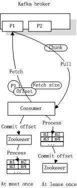

# kafka 设计原理
  
kafka的设计初衷是希望做为一个统一的信息收集平台,能够实时的收集反馈信息,并需要能够支撑较大的数据量,且具备良好的容错能力.

## 1.Persistence(持久化)

kafka使用文件存储消息(append only log),这就直接决定kafka在性能上严重依赖文件系统的本身特性.
且无论任何OS下,对文件系统本身的优化是非常艰难的.文件缓存/直接内存映射等是常用的手段.
因为kafka是对日志文件进行append操作,因此磁盘检索的开支是较小的;同时为了减少磁盘写入的次数,broker会将消息暂时buffer起来,
当消息的个数(或尺寸)达到一定阀值时,再flush到磁盘,这样减少了磁盘IO调用的次数.
对于kafka而言,较高性能的磁盘,将会带来更加直接的性能提升.

## 2.Efficiency（效率）

需要考虑的影响性能点很多,除磁盘IO之外,我们还需要考虑网络IO,这直接关系到kafka的吞吐量问题.   
kafka并没有提供太多高超的技巧;对于producer端,可以将消息buffer起来,当消息的条数达到一定阀值时,批量发送给broker;
对于consumer端也是一样,批量fetch多条消息.   
不过消息量的大小可以通过配置文件来指定.对于kafka broker端,似乎有个sendfile系统调用可以潜在的提升网络IO的性能:
将文件的数据映射到系统内存中,socket直接读取相应的内存区域即可,
而无需进程再次copy和交换(这里涉及到"磁盘IO数据"/"内核内存"/"进程内存"/"网络缓冲区",多者之间的数据copy).

其实对于producer/consumer/broker三者而言,CPU的开支应该都不大,因此启用消息压缩机制是一个良好的策略;
压缩需要消耗少量的CPU资源,不过对于kafka而言,网络IO更应该需要考虑.
可以将任何在网络上传输的消息都经过压缩.kafka支持gzip/snappy等多种压缩方式.

## 3. Producer

### Load balancing

kafka集群中的任何一个broker,都可以向producer提供metadata信息,
这些metadata中包含"集群中存活的servers列表"/"partitions leader列表"等信息(请参看zookeeper中的节点信息). 
当producer获取到metadata信息之后, producer将会和Topic下所有partition leader保持socket连接;
消息由producer直接通过socket发送到broker,中间不会经过任何"路由层".事实上,消息被路由到哪个partition上,
有producer客户端决定.比如可以采用"random""key-hash""轮询"等,如果一个topic中有多个partitions,
那么在producer端实现"消息均衡分发"是必要的.
在producer端的配置文件中,开发者可以指定partition路由的方式.

### Asynchronous send

将多条消息暂且在客户端buffer起来,并将他们批量发送到broker;小数据IO太多,会拖慢整体的网络延迟,批量延迟发送事实上提升了网络效率;
不过这也有一定的隐患,比如当producer失效时,那些尚未发送的消息将会丢失.

## 4.Consumer

consumer端向broker发送"fetch"请求,并告知其获取消息的offset;
此后consumer将会获得一定条数的消息;consumer端也可以重置offset来重新消费消息.
[备注:offset,消息偏移量,integer值,broker可以根据offset来决定消息的起始位置]

在JMS实现中,Topic模型基于push方式,即broker将消息推送给consumer端.  
不过在kafka中,采用了pull方式,即consumer在和broker建立连接之后,主动去pull(或者说fetch)消息;
这中模式有些优点,首先consumer端可以根据自己的消费能力适时的去fetch消息并处理,且可以控制消息消费的进度(offset);
此外,消费者可以良好的控制消息消费的数量,batch fetch.

其他JMS实现,消息消费的位置是有provider保留,以便避免重复发送消息或者将没有消费成功的消息重发等,同时还要控制消息的状态.
这就要求JMS broker需要太多额外的工作.在kafka中,partition中的消息只有一个consumer在消费,且不存在消息状态的控制,
也没有复杂的消息确认机制,可见kafka broker端是相当轻量级的.当消息被consumer接收之后,consumer可以在本地保存最后消息的offset,
并间歇性的向zookeeper注册offset.由此可见,consumer客户端也很轻量级.

这就意味着,kafka中consumer负责维护消息的消费记录,而broker则不关心这些,这种设计不仅提高了consumer端的灵活性,
也适度的减轻了broker端设计的复杂度;这是和众多JMS prodiver的区别.此外,kafka中消息ACK的设计也和JMS有很大不同,
kafka中的消息时批量(通常以消息的条数或者chunk的尺寸为单位)发送给consumer,当消息消费成功后,向zookeeper提交消息的offset,
而不会向broker交付ACK.或许你已经意识到,这种"宽松"的设计,将会有"丢失"消息/"消息重发"的危险.

## 5.Message Delivery Semantics

对于JMS实现,消息传输担保非常直接:有且只有一次(exactly once).在kafka中稍有不同,对于consumer而言:

1) at most once: 最多一次,这个和JMS中"非持久化"消息类似.发送一次,无论成败,将不会重发.

2) at least once: 消息至少发送一次,如果消息未能接受成功,可能会重发,直到接收成功.

3) exactly once: 消息只会发送一次.

at most once: 消费者fetch消息,然后保存offset,然后处理消息;当client保存offset之后,
但是在消息处理过程中consumer进程失效(crash),导致部分消息未能继续处理.那么此后可能其他consumer会接管,
但是因为offset已经提前保存,那么新的consumer将不能fetch到offset之前的消息(尽管它们尚没有被处理),
这就是"at most once".

at least once: 消费者fetch消息,然后处理消息,然后保存offset.如果消息处理成功之后,
但是在保存offset阶段zookeeper异常或者consumer失效,导致保存offset操作未能执行成功,
这就导致接下来再次fetch时可能获得上次已经处理过的消息,这就是"at least once".

exactly once: kafka中并没有严格的去实现(基于2阶段提交,事务),我们认为这种策略在kafka中是没有必要的.

因为"消息消费"和"保存offset"这两个操作的先后时机不同,导致了上述3种情况,通常情况下"at-least-once"是我们搜选.
(相比at most once而言,重复接收数据总比丢失数据要好).

## 6. Replication

kafka中,replication策略是基于partition,而不是topic;  
kafka将每个partition数据复制到多个server上,任何一个partition有一个leader和多个follower(可以没有);
备份的个数可以通过broker配置文件来设定.

leader处理所有的read-write请求,follower需要和leader保持同步.
Follower就像一个"consumer",消费消息并保存在本地日志中;leader负责跟踪所有的follower状态,
如果follower"落后"太多或者失效,leader将会把它从replicas同步列表中删除.当所有的follower都将一条消息保存成功,
此消息才被认为是"committed",那么此时consumer才能消费它,这种同步策略,
就要求follower和leader之间必须具有良好的网络环境.即使只有一个replicas实例存活,
仍然可以保证消息的正常发送和接收,只要zookeeper集群存活即可.(备注:不同于其他分布式存储,比如hbase需要"多数派"存活才行)

kafka判定一个follower存活与否的条件有2个:   
1) follower需要和zookeeper保持良好的链接    
2) 它必须能够及时的跟进leader,不能落后太多.如果同时满足上述2个条件,那么leader就认为此follower是"活跃的".
如果一个follower失效(server失效)或者落后太多,leader将会把它从同步列表中移除
[备注:如果此replicas落后太多,它将会继续从leader中fetch数据,直到足够up-to-date,然后再次加入到同步列表中;
kafka不会更换replicas宿主!因为"同步列表"中replicas需要足够快,这样才能保证producer发布消息时接受到ACK的延迟较小].

当leader失效时,需在followers中选取出新的leader,可能此时follower落后于leader,
因此需要选择一个"up-to-date"的follower.kafka中leader选举并没有采用"投票多数派"的算法,
因为这种算法对于"网络稳定性"/"投票参与者数量"等条件有较高的要求,而且kafka集群的设计,
还需要容忍N-1个replicas失效.对于kafka而言,每个partition中所有的replicas信息都可以在zookeeper中获得,
那么选举leader将是一件非常简单的事情.选择follower时需要兼顾一个问题,
就是新leader server上所已经承载的partition leader的个数,如果一个server上有过多的partition leader,
意味着此server将承受着更多的IO压力.在选举新leader,需要考虑到"负载均衡",
partition leader较少的broker将会更有可能成为新的leader.

在整几个集群中,只要有一个replicas存活,那么此partition都可以继续接受读写操作.

## 7.Log

如果一个topic的名称为"my_topic",它有2个partitions,那么日志将会保存在my_topic_0和my_topic_1两个目录中;
日志文件中保存了一序列"log entries"(日志条目),
每个log entry格式为"4个字节的数字N表示消息的长度" + "N个字节的消息内容";
每个日志都有一个offset来唯一的标记一条消息,offset的值为8个字节的数字,
表示此消息在此partition中所处的起始位置..每个partition在物理存储层面,
有多个log file组成(称为segment).segment file的命名为"最小offset".kafka.例如"00000000000.kafka";
其中"最小offset"表示此segment中起始消息的offset.

(摘自官网) 

其中每个partiton中所持有的segments列表信息会存储在zookeeper中.

当segment文件尺寸达到一定阀值时(可以通过配置文件设定,默认1G),将会创建一个新的文件;
当buffer中消息的条数达到阀值时将会触发日志信息flush到日志文件中,同时如果"距离最近一次flush的时间差"达到阀值时,
也会触发flush到日志文件.如果broker失效,极有可能会丢失那些尚未flush到文件的消息.
因为server意外失效,仍然会导致log文件格式的破坏(文件尾部),
那么就要求当server启东是需要检测最后一个segment的文件结构是否合法并进行必要的修复.

获取消息时,需要指定offset和最大chunk尺寸,offset用来表示消息的起始位置,
chunk size用来表示最大获取消息的总长度(间接的表示消息的条数).根据offset,可以找到此消息所在segment文件,
然后根据segment的最小offset取差值,得到它在file中的相对位置,直接读取输出即可.

日志文件的删除策略非常简单:启动一个后台线程定期扫描log file列表,把保存时间超过阀值的文件直接删除(根据文件的创建时间).
为了避免删除文件时仍然有read操作(consumer消费),采取copy-on-write方式.

## 8.Distribution

kafka使用zookeeper来存储一些meta信息,并使用了zookeeper watch机制来发现meta信息的变更并作出相应的动作(比如consumer失效,触发负载均衡等)

1)Broker node registry: 当一个kafka broker启动后,首先会向zookeeper注册自己的节点信息(临时znode),
同时当broker和zookeeper断开连接时,此znode也会被删除.

格式: /broker/ids/[0...N]   -->host:port;其中[0..N]表示broker id,
每个broker的配置文件中都需要指定一个数字类型的id(全局不可重复),znode的值为此broker的host:port信息.

2)Broker Topic Registry: 当一个broker启动时,会向zookeeper注册自己持有的topic和partitions信息,
仍然是一个临时znode.

格式: /broker/topics/[topic]/[0...N]  其中[0..N]表示partition索引号.

3)Consumer and Consumer group: 每个consumer客户端被创建时,会向zookeeper注册自己的信息;此作用主要是为了"负载均衡".

一个group中的多个consumer可以交错的消费一个topic的所有partitions;简而言之,
保证此topic的所有partitions都能被此group所消费,且消费时为了性能考虑,让partition相对均衡的分散到每个consumer上.

4)Consumer id Registry: 每个consumer都有一个唯一的ID(host:uuid,可以通过配置文件指定,也可以由系统生成),此id用来标记消费者信息.

格式: /consumers/[group_id]/ids/[consumer_id]

仍然是一个临时的znode,此节点的值为{"topic_name":#streams...},即表示此consumer目前所消费的topic + partitions列表.

5)Consumer offset Tracking: 用来跟踪每个consumer目前所消费的partition中最大的offset.

格式: /consumers/[group_id]/offsets/[topic]/[broker_id-partition_id]   -->offset_value

此znode为持久节点,可以看出offset跟group_id有关,以表明当group中一个消费者失效,其他consumer可以继续消费.

6)Partition Owner registry: 用来标记partition正在被哪个consumer消费.临时znode

格式: /consumers/[group_id]/owners/[topic]/[broker_id-partition_id]   -->consumer_node_id

此节点表达了"一个partition"只能被group下一个consumer消费,同时当group下某个consumer失效,
那么将会触发负载均衡(即:让partitions在多个consumer间均衡消费,接管那些"游离"的partitions)

当consumer启动时,所触发的操作:

A) 首先进行"Consumer id Registry";

B) 然后在"Consumer id Registry"节点下注册一个watch用来监听当前group中其他consumer的"leave"和"join";
只要此znode path下节点列表变更,都会触发此group下consumer的负载均衡.(比如一个consumer失效,
那么其他consumer接管partitions).

C) 在"Broker id registry"节点下,注册一个watch用来监听broker的存活情况;如果broker列表变更,
将会触发所有的groups下的consumer重新balance.

## Consumer均衡算法

当一个group中,有consumer加入或者离开时,会触发partitions均衡.均衡的最终目的,是提升topic的并发消费能力.

 1) 假如topic1,具有如下partitions: P0,P1,P2,P3

 2) 假如group中,有如下consumer: C0,C1

 3) 首先根据partition索引号对partitions排序: P0,P1,P2,P3

 4) 根据consumer.id排序: C0,C1

 5) 计算倍数: M = [P0,P1,P2,P3].size / [C0,C1].size,本例值M=2(向上取整)

 6) 然后依次分配partitions: C0 = [P0,P1],C1=[P2,P3],即Ci = [P(i * M),P((i + 1) * M -1)]

## 总结: 

1) Producer端使用zookeeper用来"发现"broker列表,以及和Topic下每个partition leader建立socket连接并发送消息.

2) Broker端使用zookeeper用来注册broker信息,以及监测partition leader存活性.

3) Consumer端使用zookeeper用来注册consumer信息,其中包括consumer消费的partition列表等,
同时也用来发现broker列表,并和partition leader建立socket连接,并获取消息.