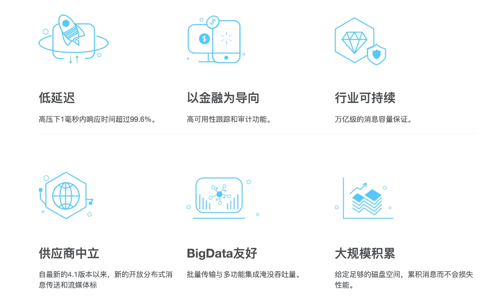
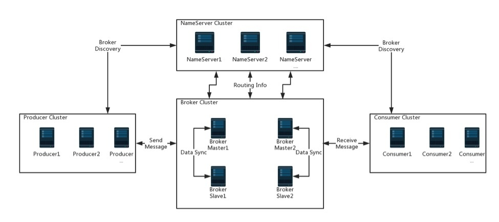
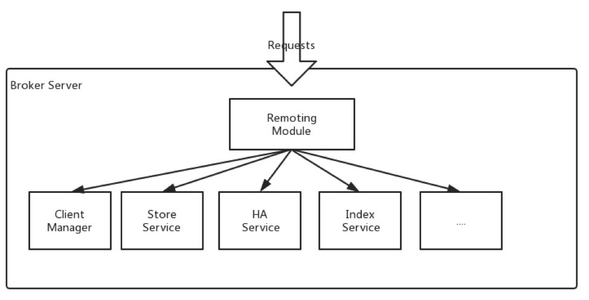

# [转载](http://www.54tianzhisheng.cn/2018/02/05/RocketMQ/)

## 介绍
RocketMQ 是阿里开源的消息中间件，已经捐献给了 Apache 。
正如[官网](http://rocketmq.apache.org/)介绍如下：
它是一个开源的分布式消息传递和流式数据平台。

特点如下：

## 产品发展历史

大约经历了三个主要版本迭代

#####  一、Metaq（Metamorphosis）1.x

由开源社区killme2008维护，开源社区非常活跃。

#### 二、Metaq 2.x

于2012年10月份上线，在淘宝内部被广泛使用。

#### 三、RocketMQ 3.x

基于公司内部开源共建原则，RocketMQ 项目只维护核心功能，且去除了所有其他运行时依赖，核心功能最简化。
每个 BU 的个性化需求都在 RocketMQ 项目之上进行深度定制。
RocketMQ 向其他 BU 提供的仅仅是 Jar 包，例如要定制一个 Broker，
那么只需要依赖 rocketmq-broker 这个 jar 包即可，可通过 API 进行交互，
如果定制 client，则依赖 rocketmq-client 这个 jar 包，对其提供的 api 进行再封装。

在 RocketMQ 项目基础上衍生的项目如下

- com.taobao.metaq v3.0 = RocketMQ + 淘宝个性化需求

为淘宝应用提供消息服务

- com.alipay.zpullmsg v1.0 =RocketMQ + 支付宝个性化需求

为支付宝应用提供消息服务

- com.alibaba.commonmq v1.0 = Notify + RocketMQ + B2B个性化需求

为 B2B 应用提供消息服务

#### 四、RocketMQ 3.x

目前它的最新版本是 4.2 版本。

### 概念专业术语

#### Producer

消息生产者，负责产生消息，一般由业务系统负责产生消息。

#### Consumer

消息消费者，负责消费消息，一般是后台系统负责异步消费。

#### Push Consumer

Consumer 的一种，应用通常向 Consumer 对象注册一个 Listener 接口，
一旦收到消息，Consumer 对象立刻回调 Listener 接口方法。

#### Pull Consumer

Consumer 的一种，应用通常主动调用 Consumer 的拉消息方法从 Broker 拉消息，主动权由应用控制。

#### Producer Group

一类 Producer 的集合名称，这类 Producer 通常发送一类消息，且发送逻辑一致。

#### Consumer Group

一类 Consumer 的集合名称，这类 Consumer 通常消费一类消息，且消费逻辑一致。

#### Broker

消息中转角色，负责存储消息，转发消息，一般也称为 Server。在 JMS 规范中称为 Provider。

### 架构

从这架构图中可以看到它主要由四部分组成：Producer（生产者）、NameServer、Broker、Consumer（消费者）。

#### Producer

生产者支持分布式部署。
分布式生产者通过多种负载均衡模式向 Broker 集群发送消息。
发送过程支持快速失败并具有低延迟。

##### NAMESERVER
它提供轻量级服务发现和路由，每个 Name Server 记录完整的路由信息，
提供相应的读写服务，支持快速存储扩展。主要包括两个功能：

- 代理管理， NameServer 接受来自 Broker 集群的注册，并提供检测代理是否存在的心跳机制。
- 路由管理，每个 NameServer 将保存有关代理群集的全部路由信息以及客户端查询的队列信息。

我们知道，RocketMQ客户端（生产者/消费者）将从NameServer查询队列路由信息，
但客户端如何找到NameServer地址？

将NameServer地址列表提供给客户端有四种方法：

- 编程方式，就像producer.setNamesrvAddr("ip:port")。
- Java选项，使用rocketmq.namesrv.addr。
- 环境变量，使用NAMESRV_ADDR。
- HTTP 端点。

##### BROKER
Broker 通过提供轻量级的 Topic 和 Queue 机制来照顾消息存储。
它们支持 Push 和 Pull 模式，包含容错机制（2个拷贝或者3个拷贝），
并且提供了强大的峰值填充和以原始时间顺序累计数千亿条消息的能力。
此外，broker 还提供灾难恢复，丰富的指标统计数据和警报机制，
而传统的消息传递系统都缺乏这些机制。

如上图：Broker 服务器重要的子模块：

- 远程处理模块是 broker 的入口，处理来自客户的请求。
- Client manager，管理客户（生产者/消费者）并维护消费者的主题订阅。
- Store Service，提供简单的 API 来存储或查询物理磁盘中的消息。
- HA 服务，提供主代理和从代理之间的数据同步功能。
- 索引服务，通过指定键为消息建立索引，并提供快速的消息查询。

#### CONSUMER
消费者也支持 Push 和 Pull 模型中的分布式部署。
它还支持群集消费和消息广播。
它提供了实时的消息订阅机制，可以满足大多数消费者的需求。

