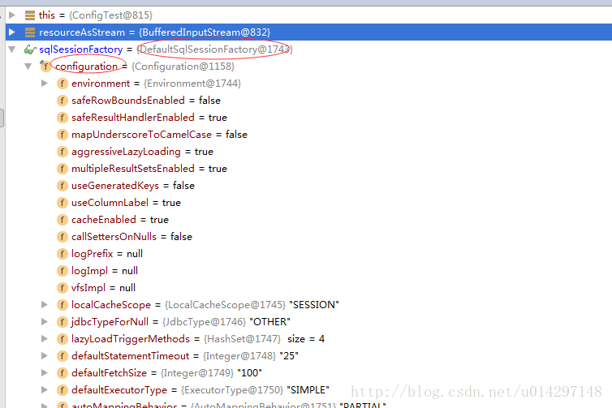

## 什么是 MyBatis ？

MyBatis 是一款优秀的持久层框架，它支持定制化 SQL、存储过程以及高级映射。 MyBatis 避免了几乎所有的 JDBC 代码和手动设置参数以及获取结果集。 MyBatis 可以使用简单的 XML 或注解来配置和映射原生信息，
将接口和 Java 的 POJOs(Plain Old Java Objects,普通的 Java对象)映射成数据库中的记录。

## Mybatis工作原理

### 1.Mybatis的架构

#### 1.1 Mybatis的框架分层


<https://blog.csdn.net/u014297148/article/details/78696096>

#### 1.2 MyBatis的实现原理

mybatis底层还是采用原生jdbc来对数据库进行操作的， 只是通过 SqlSessionFactory，SqlSession Executor,StatementHandler，ParameterHandler,
ResultHandler和TypeHandler等几个处理器封装了这些过程

```
执行器：Executor (update, query, flushStatements, commit, rollback, getTransaction, close, isClosed)

参数处理器： ParameterHandler (getParameterObject, setParameters)

结构处理器 ResultSetHandler (handleResultSets, handleOutputParameters)

sql查询处理器：StatementHandler (prepare, parameterize, batch, update, query)

```

其中StatementHandler用通过ParameterHandler与ResultHandler分别进行参数预编译 与结果处理。
而ParameterHandler与ResultHandler都使用TypeHandler进行映射。如下图：


### 2.Mybatis工作过程

通过读mybatis的源码进行分析mybatis的执行操作的整个过程， 我们通过debug调试就可以知道Mybatis每一步做了什么事，我先把debug每一步结果 截图，然后在分析这个流程。 第一步:读取配置文件，形成InputStream

#### 2.1 创建SqlSessionFactory的过程



从debug调试看出 返回的 sqlSessionFactory 是DefaultSessionFactory类型的，
但是configuration此时已经被初始化了。查看源码后画如下创建DefaultSessionFactory的时序图：


#### 2.2 创建SqlSession的过程


从debug调试 看出SqlSessionFactory.openSession() 返回的sqlSession是 DefaultSession类型的，
此SqlSession里包含一个Configuration的对象，和一个Executor对象。 查看源码后画如下创建DefaultSession的时序图：


#### 2.3 创建Mapper的过程


从debug调试可以看出，mapper是一个Mapper代理对象，而且初始化了Configuration对象，Executor的对象。 查看源码后画如下创建Mapper的时序图：


#### 2.4 执行CRUD过程

##### 2.4.1 以select为例查看各步执行的源码

1.mapper.selectEmployeeList()其实是MapperProxy执行invoke方法， 此方法显示是判断Method的方法是不是Object的toString等方法如果不是就执行MapperMethod

```

public Object invoke(Object proxy, Method method, Object[] args) throws Throwable {
// 判断Method的方法是不是Object的toString等方法 
    if(Object.class.equals(method.getDeclaringClass())) {
            try {
                return method.invoke(this, args);
            } catch (Throwable var5) {
                throw ExceptionUtil.unwrapThrowable(var5);
            }
        } else {
        //判断private final Map<Method, MapperMethod> methodCache;这个map里面有没有这个方法的一级缓存，如果没
            MapperMethod mapperMethod = this.cachedMapperMethod(method);
            return mapperMethod.execute(this.sqlSession, args);
        }
    }
    //查询一级缓存和设置一级缓存

     private MapperMethod cachedMapperMethod(Method method) {
        MapperMethod mapperMethod = (MapperMethod)this.methodCache.get(method);
        if(mapperMethod == null) {
            mapperMethod = new MapperMethod(this.mapperInterface, method, this.sqlSession.getConfiguration());
            this.methodCache.put(method, mapperMethod);
        }

        return mapperMethod;
    }

```

经过上面的调用后进入MapperMethod里面执行

``` 
//判断sql命令类型
public Object execute(SqlSession sqlSession, Object[] args) {
        Object param;
        Object result;
        if(SqlCommandType.INSERT == this.command.getType()) {
            param = this.method.convertArgsToSqlCommandParam(args);
            result = this.rowCountResult(sqlSession.insert(this.command.getName(), param));
        } else if(SqlCommandType.UPDATE == this.command.getType()) {
            param = this.method.convertArgsToSqlCommandParam(args);
            result = this.rowCountResult(sqlSession.update(this.command.getName(), param));
        } else if(SqlCommandType.DELETE == this.command.getType()) {
            param = this.method.convertArgsToSqlCommandParam(args);
            result = this.rowCountResult(sqlSession.delete(this.command.getName(), param));
        } else if(SqlCommandType.SELECT == this.command.getType()) {
        //我们测试的是select类型，则再判断这个方法的返回类型
            if(this.method.returnsVoid() && this.method.hasResultHandler()) {
                this.executeWithResultHandler(sqlSession, args);
                result = null;
            } else if(this.method.returnsMany()) {
               //我们是查询列表，此方法执行
                result = this.executeForMany(sqlSession, args);
            } else if(this.method.returnsMap()) {
                result = this.executeForMap(sqlSession, args);
            } else {
                param = this.method.convertArgsToSqlCommandParam(args);
                result = sqlSession.selectOne(this.command.getName(), param);
            }
        } else {
            if(SqlCommandType.FLUSH != this.command.getType()) {
                throw new BindingException("Unknown execution method for: " + this.command.getName());
            }

            result = sqlSession.flushStatements();
        }

        if(result == null && this.method.getReturnType().isPrimitive() && !this.method.returnsVoid()) {
            throw new BindingException("Mapper method '" + this.command.getName() + " attempted to return null from a method with a primitive return type (" + this.method.getReturnType() + ").");
        } else {
            return result;
        }
    }

private <E> Object executeForMany(SqlSession sqlSession, Object[] args) {
//将param做处理 自动处理为param1,param2..
        Object param = this.method.convertArgsToSqlCommandParam(args);
        List result;
        if(this.method.hasRowBounds()) {
            RowBounds rowBounds = this.method.extractRowBounds(args);
            //调用该对象的DefaultSqlSession的selectList方法
            result = sqlSession.selectList(this.command.getName(), param, rowBounds);
        } else {
            result = sqlSession.selectList(this.command.getName(), param);
        }

        return !this.method.getReturnType().isAssignableFrom(result.getClass())?(this.method.getReturnType().isArray()?this.convertToArray(result):this.convertToDeclaredCollection(sqlSession.getConfiguration(), result)):result;
    }

//处理参数方法
 public Object convertArgsToSqlCommandParam(Object[] args) {
            int paramCount = this.params.size();
            if(args != null && paramCount != 0) {
                if(!this.hasNamedParameters && paramCount == 1) {
                    return args[((Integer)this.params.keySet().iterator().next()).intValue()];
                } else {
                    Map<String, Object> param = new MapperMethod.ParamMap();
                    int i = 0;

                    for(Iterator i$ = this.params.entrySet().iterator(); i$.hasNext(); ++i) {
                        Entry<Integer, String> entry = (Entry)i$.next();
                        param.put(entry.getValue(), args[((Integer)entry.getKey()).intValue()]);
                        String genericParamName = "param" + String.valueOf(i + 1);
                        if(!param.containsKey(genericParamName)) {
                            param.put(genericParamName, args[((Integer)entry.getKey()).intValue()]);
                        }
                    }

                    return param;
                }
            } else {
                return null;
            }
        }
        
```

调用DefaultSqlSession的selectList的方法

``` 
 public <E> List<E> selectList(String statement, Object parameter, RowBounds rowBounds) {
        List var5;
        try {
        //获取MappedStatement对象
            MappedStatement ms = this.configuration.getMappedStatement(statement);
            //调用cachingExecutor执行器的方法
            var5 = this.executor.query(ms, this.wrapCollection(parameter), rowBounds, Executor.NO_RESULT_HANDLER);
        } catch (Exception var9) {
            throw ExceptionFactory.wrapException("Error querying database.  Cause: " + var9, var9);
        } finally {
            ErrorContext.instance().reset();
        }

        return var5;
    }

//CachingExector的query方法
public <E> List<E> query(MappedStatement ms, Object parameterObject, RowBounds rowBounds, ResultHandler resultHandler) throws SQLException {
    //
        BoundSql boundSql = ms.getBoundSql(parameterObject);
        CacheKey key = this.createCacheKey(ms, parameterObject, rowBounds, boundSql);
        //调用下2代码
        return this.query(ms, parameterObject, rowBounds, resultHandler, key, boundSql);
    }
    //2代码
 public <E> List<E> query(MappedStatement ms, Object parameterObject, RowBounds rowBounds, ResultHandler resultHandler, CacheKey key, BoundSql boundSql) throws SQLException {
        Cache cache = ms.getCache();
        if(cache != null) {
            this.flushCacheIfRequired(ms);
            if(ms.isUseCache() && resultHandler == null) {
                this.ensureNoOutParams(ms, parameterObject, boundSql);
                List<E> list = (List)this.tcm.getObject(cache, key);
                if(list == null) {
                //这里是调用Executor里的query方法 如果开启了缓存这掉CachingExecutor的 如果没有则是调用BaseExecutor的
                    list = this.delegate.query(ms, parameterObject, rowBounds, resultHandler, key, boundSql);
                    this.tcm.putObject(cache, key, list);
                }

                return list;
            }
        }

        return this.delegate.query(ms, parameterObject, rowBounds, resultHandler, key, boundSql);
    }

```

BaseExecutor的query方法

``` 
public <E> List<E> query(MappedStatement ms, Object parameter, RowBounds rowBounds, ResultHandler resultHandler, CacheKey key, BoundSql boundSql) throws SQLException {
        ErrorContext.instance().resource(ms.getResource()).activity("executing a query").object(ms.getId());
        if(this.closed) {
            throw new ExecutorException("Executor was closed.");
        } else {
            if(this.queryStack == 0 && ms.isFlushCacheRequired()) {
                this.clearLocalCache();
            }

            List list;
            try {
                ++this.queryStack;
                list = resultHandler == null?(List)this.localCache.getObject(key):null;
                if(list != null) {
                    this.handleLocallyCachedOutputParameters(ms, key, parameter, boundSql);
                } else {
                //如果缓存中没有就从数据库中查询
                    list = this.queryFromDatabase(ms, parameter, rowBounds, resultHandler, key, boundSql);
                }
            } finally {
                --this.queryStack;
            }

            if(this.queryStack == 0) {
                Iterator i$ = this.deferredLoads.iterator();

                while(i$.hasNext()) {
                    BaseExecutor.DeferredLoad deferredLoad = (BaseExecutor.DeferredLoad)i$.next();
                    deferredLoad.load();
                }

                this.deferredLoads.clear();
                if(this.configuration.getLocalCacheScope() == LocalCacheScope.STATEMENT) {
                    this.clearLocalCache();
                }
            }

            return list;
        }
    }

//从数据库中查询
private <E> List<E> queryFromDatabase(MappedStatement ms, Object parameter, RowBounds rowBounds, ResultHandler resultHandler, CacheKey key, BoundSql boundSql) throws SQLException {
        //放入缓存
        this.localCache.putObject(key, ExecutionPlaceholder.EXECUTION_PLACEHOLDER);

        List list;
        try {
        //此处是调用子Executor的方法，ExecutorType默认是使用的SimpleExecutor
            list = this.doQuery(ms, parameter, rowBounds, resultHandler, boundSql);
        } finally {
            this.localCache.removeObject(key);
        }

        this.localCache.putObject(key, list);
        if(ms.getStatementType() == StatementType.CALLABLE) {
            this.localOutputParameterCache.putObject(key, parameter);
        }

        return list;
    }

```

SimpleExecutor的doQuery方法

``` 
public <E> List<E> doQuery(MappedStatement ms, Object parameter, RowBounds rowBounds, ResultHandler resultHandler, BoundSql boundSql) throws SQLException {
        Statement stmt = null;

        List var9;
        try {
            Configuration configuration = ms.getConfiguration();
            //创建StateMentHandler处理器
            StatementHandler handler = configuration.newStatementHandler(this.wrapper, ms, parameter, rowBounds, resultHandler, boundSql);
            //调用下3的方法
            stmt = this.prepareStatement(handler, ms.getStatementLog());
            //调用no4的方法
            var9 = handler.query(stmt, resultHandler);
        } finally {
            this.closeStatement(stmt);
        }

        return var9;
    }
    //下3方法
private Statement prepareStatement(StatementHandler handler, Log statementLog) throws SQLException {
        Connection connection = this.getConnection(statementLog);
        Statement stmt = handler.prepare(connection);
        //SatementHanlder 采用PreparedStatementHandler来实现此方法，而PreparedStatementHandler调用的是父接口ParameterHandler的方法
        handler.parameterize(stmt);
        return stmt;
    }
    
```

ParameterHandler参数处理器的方法

``` 
public interface ParameterHandler {
    Object getParameterObject();
    //此方法是用DefaultParameterHandler实现的
    void setParameters(PreparedStatement var1) throws SQLException;
}

```

DefaultParameterHandler默认参数处理器的方法

``` 
public void setParameters(PreparedStatement ps) {
        ErrorContext.instance().activity("setting parameters").object(this.mappedStatement.getParameterMap().getId());
        List<ParameterMapping> parameterMappings = this.boundSql.getParameterMappings();
        if(parameterMappings != null) {
            for(int i = 0; i < parameterMappings.size(); ++i) {
                ParameterMapping parameterMapping = (ParameterMapping)parameterMappings.get(i);
                if(parameterMapping.getMode() != ParameterMode.OUT) {
                    String propertyName = parameterMapping.getProperty();
                    Object value;
                    if(this.boundSql.hasAdditionalParameter(propertyName)) {
                        value = this.boundSql.getAdditionalParameter(propertyName);
                    } else if(this.parameterObject == null) {
                        value = null;
                    } else if(this.typeHandlerRegistry.hasTypeHandler(this.parameterObject.getClass())) {
                        value = this.parameterObject;
                    } else {
                        MetaObject metaObject = this.configuration.newMetaObject(this.parameterObject);
                        value = metaObject.getValue(propertyName);
                    }
                   //这里用调用 TypeHandler类型映射处理器来映射
                    TypeHandler typeHandler = parameterMapping.getTypeHandler();
                    JdbcType jdbcType = parameterMapping.getJdbcType();
                    if(value == null && jdbcType == null) {
                        jdbcType = this.configuration.getJdbcTypeForNull();
                    }

                    try {
                    //类型处理器设置参数映射
                                               typeHandler.setParameter(ps, i + 1, value, jdbcType);
                    } catch (TypeException var10) {
                        throw new TypeException("Could not set parameters for mapping: " + parameterMapping + ". Cause: " + var10, var10);
                    } catch (SQLException var11) {
                        throw new TypeException("Could not set parameters for mapping: " + parameterMapping + ". Cause: " + var11, var11);
                    }
                }
            }
        }

    }
    
```

no4的方法

```
  public <E> List<E> query(Statement statement, ResultHandler resultHandler) throws SQLException {
       //此处调用原生sql的处理器
        PreparedStatement ps = (PreparedStatement)statement;
        //发出原生sql命令
        ps.execute();
        //采用ResultHandler结果处理器对结果集封装
        return this.resultSetHandler.handleResultSets(ps);
    }
```

ResultHandler代码

```
public interface ResultSetHandler {
    //此处调用的是DefaultResultSetHandler的方法
    <E> List<E> handleResultSets(Statement var1) throws SQLException;

    void handleOutputParameters(CallableStatement var1) throws SQLException;
}
```

DefaultResultSetHandler的方法

``` 
public List<Object> handleResultSets(Statement stmt) throws SQLException {
        ErrorContext.instance().activity("handling results").object(this.mappedStatement.getId());
        List<Object> multipleResults = new ArrayList();
        int resultSetCount = 0;
        ResultSetWrapper rsw = this.getFirstResultSet(stmt);
        List<ResultMap> resultMaps = this.mappedStatement.getResultMaps();
        int resultMapCount = resultMaps.size();
        this.validateResultMapsCount(rsw, resultMapCount);

        while(rsw != null && resultMapCount > resultSetCount) {
            ResultMap resultMap = (ResultMap)resultMaps.get(resultSetCount);
            this.handleResultSet(rsw, resultMap, multipleResults, (ResultMapping)null);
            rsw = this.getNextResultSet(stmt);
            this.cleanUpAfterHandlingResultSet();
            ++resultSetCount;
        }

        String[] resultSets = this.mappedStatement.getResulSets();
        if(resultSets != null) {
            while(rsw != null && resultSetCount < resultSets.length) {
                ResultMapping parentMapping = (ResultMapping)this.nextResultMaps.get(resultSets[resultSetCount]);
                if(parentMapping != null) {
                    String nestedResultMapId = parentMapping.getNestedResultMapId();
                    ResultMap resultMap = this.configuration.getResultMap(nestedResultMapId);
                    this.handleResultSet(rsw, resultMap, (List)null, parentMapping);
                }

                rsw = this.getNextResultSet(stmt);
                this.cleanUpAfterHandlingResultSet();
                ++resultSetCount;
            }
        }

        return this.collapseSingleResultList(multipleResults);
    }
//处理结果集
 private void handleResultSet(ResultSetWrapper rsw, ResultMap resultMap, List<Object> multipleResults, ResultMapping parentMapping) throws SQLException {
        try {
            if(parentMapping != null) {
                this.handleRowValues(rsw, resultMap, (ResultHandler)null, RowBounds.DEFAULT, parentMapping);
            } else if(this.resultHandler == null) {
                DefaultResultHandler defaultResultHandler = new DefaultResultHandler(this.objectFactory);
                this.handleRowValues(rsw, resultMap, defaultResultHandler, this.rowBounds, (ResultMapping)null);
                multipleResults.add(defaultResultHandler.getResultList());
            } else {
                this.handleRowValues(rsw, resultMap, this.resultHandler, this.rowBounds, (ResultMapping)null);
            }
        } finally {
            this.closeResultSet(rsw.getResultSet());
        }

    }

private void handleRowValues(ResultSetWrapper rsw, ResultMap resultMap, ResultHandler<?> resultHandler, RowBounds rowBounds, ResultMapping parentMapping) throws SQLException {
        if(resultMap.hasNestedResultMaps()) {
            this.ensureNoRowBounds();
            this.checkResultHandler();
            this.handleRowValuesForNestedResultMap(rsw, resultMap, resultHandler, rowBounds, parentMapping);
        } else {
            this.handleRowValuesForSimpleResultMap(rsw, resultMap, resultHandler, rowBounds, parentMapping);
        }

    }

   private void handleRowValuesForNestedResultMap(ResultSetWrapper rsw, ResultMap resultMap, ResultHandler<?> resultHandler, RowBounds rowBounds, ResultMapping parentMapping) throws SQLException {
        DefaultResultContext<Object> resultContext = new DefaultResultContext();
        this.skipRows(rsw.getResultSet(), rowBounds);
        Object rowValue = null;

        while(this.shouldProcessMoreRows(resultContext, rowBounds) && rsw.getResultSet().next()) {
            ResultMap discriminatedResultMap = this.resolveDiscriminatedResultMap(rsw.getResultSet(), resultMap, (String)null);
            CacheKey rowKey = this.createRowKey(discriminatedResultMap, rsw, (String)null);
            Object partialObject = this.nestedResultObjects.get(rowKey);
            if(this.mappedStatement.isResultOrdered()) {
                if(partialObject == null && rowValue != null) {
                    this.nestedResultObjects.clear();
                    this.storeObject(resultHandler, resultContext, rowValue, parentMapping, rsw.getResultSet());
                }
        //获取行的值
                rowValue = this.getRowValue(rsw, discriminatedResultMap, rowKey, (String)null, partialObject);
            } else {
                rowValue = this.getRowValue(rsw, discriminatedResultMap, rowKey, (String)null, partialObject);
                if(partialObject == null) {
                    this.storeObject(resultHandler, resultContext, rowValue, parentMapping, rsw.getResultSet());
                }
            }
        }

        if(rowValue != null && this.mappedStatement.isResultOrdered() && this.shouldProcessMoreRows(resultContext, rowBounds)) {
            this.storeObject(resultHandler, resultContext, rowValue, parentMapping, rsw.getResultSet());
        }

    }
    String resultMapId = resultMap.getId();
        Object resultObject = partialObject;
        if(partialObject != null) {
            MetaObject metaObject = this.configuration.newMetaObject(partialObject);
            this.putAncestor(partialObject, resultMapId, columnPrefix);
            this.applyNestedResultMappings(rsw, resultMap, metaObject, columnPrefix, combinedKey, false);
            this.ancestorObjects.remove(resultMapId);
        } else {
            ResultLoaderMap lazyLoader = new ResultLoaderMap();
            resultObject = this.createResultObject(rsw, resultMap, lazyLoader, columnPrefix);
            if(resultObject != null && !this.typeHandlerRegistry.hasTypeHandler(resultMap.getType())) {
                MetaObject metaObject = this.configuration.newMetaObject(resultObject);
                boolean foundValues = !resultMap.getConstructorResultMappings().isEmpty();
                if(this.shouldApplyAutomaticMappings(resultMap, true)) {
                    foundValues = this.applyAutomaticMappings(rsw, resultMap, metaObject, columnPrefix) || foundValues;
                }

                foundValues = this.applyPropertyMappings(rsw, resultMap, metaObject, lazyLoader, columnPrefix) || foundValues;
                this.putAncestor(resultObject, resultMapId, columnPrefix);
                foundValues = this.applyNestedResultMappings(rsw, resultMap, metaObject, columnPrefix, combinedKey, true) || foundValues;
                this.ancestorObjects.remove(resultMapId);
                foundValues = lazyLoader.size() > 0 || foundValues;
                resultObject = foundValues?resultObject:null;
            }

            if(combinedKey != CacheKey.NULL_CACHE_KEY) {
                this.nestedResultObjects.put(combinedKey, resultObject);
            }
        }

        return resultObject;
    }


private boolean shouldApplyAutomaticMappings(ResultMap resultMap, boolean isNested) {
        return resultMap.getAutoMapping() != null?resultMap.getAutoMapping().booleanValue():(isNested?AutoMappingBehavior.FULL == this.configuration.getAutoMappingBehavior():AutoMappingBehavior.NONE != this.configuration.getAutoMappingBehavior());
    }
 private boolean applyAutomaticMappings(ResultSetWrapper rsw, ResultMap resultMap, MetaObject metaObject, String columnPrefix) throws SQLException {
        List<DefaultResultSetHandler.UnMappedColumAutoMapping> autoMapping = this.createAutomaticMappings(rsw, resultMap, metaObject, columnPrefix);
        boolean foundValues = false;
        if(autoMapping.size() > 0) {
            Iterator i$ = autoMapping.iterator();

            while(true) {
           //这里使用了内部类对参数和结果集进行映射
               DefaultResultSetHandler.UnMappedColumAutoMapping mapping;
                Object value;
                do {
                    if(!i$.hasNext()) {
                        return foundValues;
                    }

                    mapping = (DefaultResultSetHandler.UnMappedColumAutoMapping)i$.next();
                    value = mapping.typeHandler.getResult(rsw.getResultSet(), mapping.column);
                } while(value == null && !this.configuration.isCallSettersOnNulls());

                if(value != null || !mapping.primitive) {
                    metaObject.setValue(mapping.property, value);
                }

                foundValues = true;
            }
        } else {
            return foundValues;
        }
    }
 private static class UnMappedColumAutoMapping {
        private final String column;
        private final String property;
        private final TypeHandler<?> typeHandler;
        private final boolean primitive;

    //此处才类型器对结果进行映射
        public UnMappedColumAutoMapping(String column, String property, TypeHandler<?> typeHandler, boolean primitive) {
            this.column = column;
            this.property = property;
            this.typeHandler = typeHandler;
            this.primitive = primitive;
        }
    }
    
```

### 基本原理

本文中Mybatis基本原理切入，同时摘录Mybatis的源码，理解Mybatis框架的工作原理。首先看一段JDBC代码：

```
	Class.forName("com.mysql.jdbc.Driver");
	String url = "jdbc:mysql://localhost:3306/localdb";
	Connection con = DriverManager.getConnection(url, "root","password");			
	String sql = "SELECT name FROM t_test_employee WHERE id = ?";
	PreparedStatement ps = con.prepareStatement(sql);
	ps.setString(1, "123");
	ResultSet rs = ps.executeQuery();
	while(rs.next()){
		System.out.println("name=" + rs.getString(1));
	}
	con.close();
```

大家应该比较熟悉这段代码，典型的jdbc流程:

> 建立连接->传递sql->传递参数->sql执行->处理结果->关闭连接。

ORM框架的本质是抽取共性、封装逻辑。

现在，如果我们来设计一个ORM框架该如何设计？

仔细考虑JDBC流程，可以发现流程中需要用户配置的输入和输出是变化的(如下，括号中部分)，而其他部分则是固定不变的逻辑。

> 建立连接(数据源配置信息)->传递sql(sql语句)->传递参数(sql参数)->sql执行->处理结果(映射关系)->关闭连接

数据源配置信息:配置文件，在启动时从配置文件中读取并建立数据源对象

Sql语句：配置文件(代码)，在启动时抽取解析，以<Key,SQL>的形式存储

Sql参数：java bean对象，在执行前从对象中抽取

映射关系：配置文件(代码)，根据映射关系读取结果集并创建java bean返回。

不难想象，Mybatis会在启动时”读取配置数据(builder)”，”建立数据源(datasource)”; 然后程序开始执行，传递sql语句的”Key”和java bean; 最后”执行SQL，处理结果(executor)”。
当然，Mybatis也要负责”连接管理(session)”和”事务管理(transaction)”等内容。

### 源码解析

Mybatis的配置分为两种：基于XML配置和基于注解配置。两者的原理大同小异，在此仅以“基于注解配置”为例解析Mybatis。

启动配置解析 “基于注解配置”一般使用Mybatis-Spring，其工作原理详见深入理解Mybatis-Spring工作原理
<http://cyningsun.github.io/08-17-2014/reading-mybatis-spring-source-code.html>，

可以看到启动后所有Mapper的实现类被设置为了MapperFactoryBean， MapperFactoryBean是一个工厂类，
它通过SqlSession-Configuration-MapperRegistry得到Mapper的代理类MapperProxy，以实例化Mapper属性。

SQL(参数)解析与执行 Mapper执行时调用MapperProxy的invoke方法，MapperProxy创建MapperMethod对象用于执行具体SQL，
通过annotation获取得到参数化的sql语句，通过传递的参数获取SQL参数。

``` 
public MapperMethod(Class<?> mapperInterface, Method method, Configuration config) {
	//解析annotation中的SQL语句
    this.command = new SqlCommand(config, mapperInterface, method);
	//处理sql，建立①param数组
    this.method = new MethodSignature(config, method);
  }
  
   public Object execute(SqlSession sqlSession, Object[] args) {
    Object result;
    if (SqlCommandType.INSERT == command.getType()) { //判断sql类型
	  //使用①param数组建立param-Object对应关系
      Object param = method.convertArgsToSqlCommandParam(args);
	  //执行sql并处理结果集的映射
      result = rowCountResult(sqlSession.insert(command.getName(), param));
    }
	...
	
	//XXXExecutor.java
	public int doUpdate(MappedStatement ms, Object parameter) throws SQLException {
    Statement stmt = null;
    try {
      Configuration configuration = ms.getConfiguration();
      StatementHandler handler = configuration.newStatementHandler(this, ms, parameter, RowBounds.DEFAULT, null, null);
	  //使用TypeHandler处理参数
      stmt = prepareStatement(handler, ms.getStatementLog());
      return handler.update(stmt);
    } finally {
      closeStatement(stmt);
    }
  }

```
