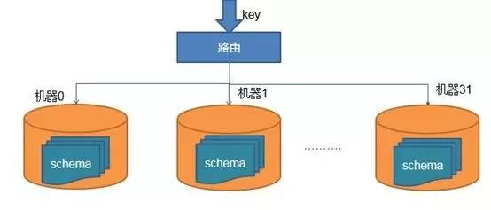

## [转载](https://mp.weixin.qq.com/s?__biz=MzI3MzEzMDI1OQ==&mid=2651814835&idx=1&sn=cb775d3926ce39d12fa420a292c1f83d&scene=0#wechat_redirect)

# 高性能数据库连接池的内幕

大家可能会有这样疑问：连接池类似于线程池或者对象池，就是一个放连接的池子，使用的时候从里面拿一个，用完了再归还， 功能非常简单，有什么可讲的。

可能还会有这样的疑问：高性能这么高大上，一个小小的连接池，如何跟高大上靠上边的。

本主题将会全面介绍连接池原理，高性能的设计，优化实践，现有连接池的瓶颈及解决方案。

### 为什么要有连接池

先看一下连接池所处的位置：

应用框架的业务实现一般都会访问数据库，缓存或者HTTP服务。为什么要在访问的地方加上一个连接池呢？

下面以访问MySQL为例，执行一个SQL命令，如果不使用连接池，需要经过哪些流程。

1：TCP建立连接的三次握手

2：MySQL认证的三次握手

3：真正的SQL执行

4：MySQL的关闭

5：TCP的四次握手关闭

可以看到，为了执行一条SQL，却多了非常多我们不关心的网络交互。

优点：实现简单。

缺点：

1：网络IO较多

2：数据库的负载较高

3：响应时间较长及QPS较低

4：应用频繁的创建连接和关闭连接，导致临时对象较多，GC频繁

5：在关闭连接后，会出现大量TIME_WAIT 的TCP状态（在2个MSL之后关闭）

### 使用连接池流程

第一次访问的时候，需要建立连接。 但是之后的访问，均会复用之前创建的连接。

优点：

1：较少了网络开销

2：系统的性能会有一个实质的提升

3：没了麻烦的TIME_WAIT状态

当然，现实往往是残酷的，当我们解决了一个问题的时候，同时伴随着另外一个问题的产生。

使用连接池面临的最大挑战： 连接池的性能

### 连接数和线程数性能优化

分库DB部署结构：

假设有128个分库：32个服务器，每个服务器有4个schema。按照128个分库的设计，便会新建128个独立数据库连接池。

数据库连接池的模型

- 特点：

1：128个连接池完全独立，不同的schema也对应不同的连接池

2：先通过拆库，读写等策略选择对应的连接池，再从连接池获取一个连接进行操作

3：操作完后，再将连接归还到对应的连接池中。

- 优点：

结构简单，分散竞争

##### 面临的问题：

- 1：线程数过多

先看一下新建一个连接池，需要新建的线程数的个数。

连接池| 线程数 | 描述 | 128个分库需要的线程数
---  |---|---|---
C3P0 | 4 | 3个helperThread (pollerThread)，1个定时任务AdminTaskTimer(DeadlockDetector) |4*128=512
DBCP | 1 | 负责心跳，最小连接数维持，最大空闲时间和防连接泄露 | 1*128=128
Druid| 2 | 一个异步创建连接。一个异步关闭连接。 | 2*128=256

可以看到随着分库的增加，不管选用哪个连接池，线程的个数均会线性增长。 线程数过多将会导致内存占用较大: 默认1个线程会占用1M的空间，如果是512个线程，则会占用1M*512=512M上下文切换开销。

Tips：由于stack和heap申请为虚地址空间，但是一旦使用就不会释放。(线程也不一定会占用1M的空间)

- 2：连接数过多

数据库的连接资源比较重，并且随着连接的增加，数据库的性能会有明显的下降。 DBA一般会限制每个DB建立连接的个数，比如限制为3K 。假设数据库单台限制3K，32台则容量为3K*32=96K。
如果应用最大，最小连接数均为10，则每个应用总计需要128*10=1.28K个连接。 那么数据库理论上支持的应用个数为96K/1.28K= 80 台

- 3：不能连接复用

同一个物理机下面不同的schema完全独立，连接不能复用

优化后的数据库连接池模型

- 特点：

1：只有一个连接池,所有节点共享线程 （解决了线程数过多的问题）

2：每个物理机对应一个host, host里面维护多个schema，schema存放连接。

3：同一个host下面的不同schema 可以进行连接复用(解决连接数过多的问题)

###### 获取连接流程：

1：获取连接需要带上 ip,port和schema信息：比如获取的是host31的schema1

2：先到host31的schema1中获取空闲连接，但是schema1无空闲连接，便会从schema2中获取空闲连接。

3：从schema2中获取的连接执行useschema1，该连接便切换到schema1上面。

4：执行对应的SQL操作，执行完成后，归还连接到schema1的池子里面。

优点：

1：连接复用：有效减少连接数。

2：提升性能：避免频繁的新建连接。新建连接的开销比较大，而使用use schema开销非常小

3：有效减少线程数。按现有方案大概只需要4个线程即可。而优化前需要512个线程

缺点：

1：管理较为复杂

2：不符合JDBC接口规范。DataSource只有简单的getConnection()接口，没有针对获取对应schema的连接的接口。 需要继承DataSource，实现特定接口。

### 事务语句性能优化

优化前执行事务的模型

从连接池里面获取到连接，默认是自动提交。

为了开启事务，需要执行setautocommit=false 操作， 然后再执行具体的SQL，归还连接的时候，还需要将连接设置为自动提交(需要执行set autocommit=true) 。 可以看到开启事务，需要额外执行两条事务的语句。

优化后执行事务的模型

每个schema里面所有的连接会按照autocommit进行分组。 分为自动提交(autocommit=true) 和非自动提交(autocommit=false)。
获取连接时优先获取相同autocommit的分组里的连接，如果没有可用连接则从另外一个分组中获取连接， 业务操作执行完后，再归还到对应的分组里面。该种机制避免了开启事务多执行的两条事务语句。

### 锁性能优化

连接池的通用功能：

连接池主要包含五部分：获取连接，归还连接，定时任务，维护组件及资源池

获取连接：

    1：获取超时：如果超过规定时间未获取到连接，则会抛出异常

    2：有效性检查：当从资源池里面获取到资源，需要检查该资源的有效性，如果失效，再次获取连接。避免执行业务的时候报错。

    3：创建连接：可以同步创建，也可以异步创建。

归还连接：

    1：归还连接：比如需要检查最大空闲数，确定是物理关闭还是归还到连接池

    2：销毁连接: 可同步销毁也可异步销毁

定时任务：

    1：空闲检查：主要是检查空闲连接，连接空闲超过一定时间，则会关闭连接。

    2：最小连接数控制：一般会设置最小连接数。保证当前系统里面最小的连接数。如果不够，则会新建连接。

组件维护：

    1：连接状态控制：空闲，使用，删除等状态控制

    2：异常处理：对JDBC访问的异常统一处理，如果异常与连接相关，则会将该连接销毁掉。

    3：缓存：避免对SQL重复解析，PrepareStatement机制下，会对SQL解析的对象进行缓存。

    4：JDBC封装：对JDBC进行了实现，真正的实现是底层的driver,比如MySQL-connector-java 。

资源池：

    1：资源池是存放连接的地方，也是连接池最核心的地方。

    2：所有的组件基本上都与资源池进行交互，对连接资源的竞争非常激烈。该处的性能将决定了整个连接池的性能。

    3：一般资源池的实现是使用JDK提供的BlockingQueue。那么是否有方案可以进行无锁的设计，来避免竞争。

- 获取连接大概流程：

1：从ThreadLocal里面获取连接，如果没有空闲连接，则从全局连接池(CopyOnWriteArrayList)中获取。

2：如果全局连接池中没有空闲连接，则会异步新建连接。

3：判定超时时间是否大于阈值，如果小于阈值，则进行自旋。否则进行park休眠。

4：连接建立成功后，会对park的线程进行唤醒

主要从四个方面实现了无锁的设计：ThreadLocal,CopyOnWriteArrayList，异步建立连接及自旋。

- ThreadLocal

1：每个线程均有一个连接队列。该队列是全局队列的引用。

2：获取连接时先从ThreadLocal里面拿连接，如果连接是空闲状态，则使用。否则移除掉，再拿下一个，直到拿不到连接为止。

3：归还连接时，只需要归还到ThreadLocal的队列里面，同时设置连接为空闲状态

4：如果使用BlockQueue,获取连接时调用poll,归还连接时调用offer，存在两次锁的竞争。 优化后通过CAS避免了两次锁的开销(获取连接时，使用CAS置连接为非空闲状态；归还时，使用CAS置连接为空闲状态)

- CopyOnWriteArrayList

1：该队列使用场景是：大量读，少量写的操作，并且存储的数据比较有限。而连接池的场景非常适合采用CopyOnWriteArrayList。

2：在获取连接或者归还连接时，只会通过CAS更改连接的状态，不会对连接池进行添加或者删除的操作。

3：一般连接池连接的个数比较可控，CopyOnWriteArrayList在写操作时会对所有连接进行拷贝，对内存影响不大。

- 异步建立连接

获取到连接后，判断一下是否有并发正在等待获取连接，如果有，则异步建立连接。 避免下一个连接的等待。如果CopyOnWriteArrayList没有空闲连接，则异步建立连接。

- 自旋

该自旋比较类似于JDK对synchronized的自旋机制。如果发现超时时间大于设定的阈值(比如10微秒)，则会进行线程挂起。 如果小于设定的阈值，则重新获取连接，进行自选，避免线程的上下文切换带来的性能开销。。

### 优化小技巧

方法内联优化

1：每调用一次方法，线程便会新建一个栈帧，新建栈帧开销相对比较大

2：JIT在运行时会进行内联优化，多个方法使用一个栈帧，避免栈帧新建过多

3：JIT方法内联优化默认的字节码个数阈值是35个字节，低于35个字节，才会进行优化。(可通过-XX:MaxInlineSize=35进行设置)

通过修改上述代码，编译后字节码修改到34个字节，则可以满足内联的条件。

心跳语句选择

PrepareStatement模式选择

MySQL driver默认是client模式，如果需要开启server模式，需要设置 useServerPrepStmts=true 。 PrepareStatement默认的client模式和Statement对于DB端没有区别。
大家普遍理解PrepareStatement和Statement的区别是PrepareStatement可以避免SQL注入。但是避免SQL注入是如何做到的？

使用PrepareStatement设置参数的时候，比如调用setString(int parameterIndex, String x)， 本地会对设置的参数进行转义来避免SQL注入。

执行SQL的时候，会将SQL的?替换成转义后的字符，发送到数据库执行。

PSCache

MySQLdriver 默认不开启，可通过设置 cachePrepStmts = true 进行开启

QueryTimeout

之前也遇到因为开启了queryTimeout，导致连接泄露的问题。

具体可参考：

MySQL driver的bug发现之旅：
http://blog.csdn.net/hetaohappy/article/details/52091005
关于连接池的最优配置之前做过整理，可参考：

http://blog.csdn.net/hetaohappy/article/details/51861015

[主流Java数据库连接池比较及前瞻]<http://blog.didispace.com/java-datasource-pool-compare/?utm_source=oschina-app>

