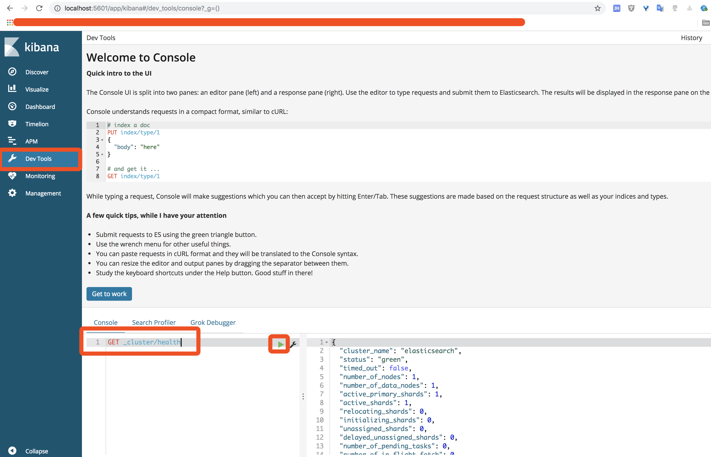

## [原文](https://www.jianshu.com/p/975326e65f65)

# Elasticsearch 安装


- [Elasticsearch 下载地址](https://www.elastic.co/downloads/elasticsearch)

把下载好的tar包解压至/usr/local目录下

1. 移动 elasticsearch-6.4.1.tar.gz 到 /usr/local

> mv elasticsearch-6.4.1.tar.gz /usr/local

2. 解压

>  tar -zxvf elasticsearch-6.4.1.tar.gz

3. 进入elasticsearch-6.4.1 目录，然后启动

> ./bin/elasticsearch

注意：如果是root用户启动貌似会报错
```
//部分错误如下
[2017-03-15T22:16:22,913][WARN ][o.e.b.ElasticsearchUncaughtExceptionHandler] [] uncaught exception in thread [main]
org.elasticsearch.bootstrap.StartupException: java.lang.RuntimeException: can not run elasticsearch as root

```

报错明确指出，不能以root用户启动 \
这种情况下，需要先改变目录的用户权限，然后再以普通用户启动

>  [root@localhost local]#  chown -R hncl elasticsearch-6.4.1 \
   [root@localhost local]# su - hncl \
   [hncl@localhost elasticsearch-5.2.2]$ ./bin/elasticsearc
   


这是启动时，还会遇到一些的报错，可以看[这篇博客解决](http://www.cnblogs.com/sloveling/p/elasticsearch.html)

启动后，在浏览器输入<http://localhost:9200/?pretty>检查ES是否启动成功

```json
{
    "name": "1m9BgVq",
    "cluster_name": "elasticsearch",
    "cluster_uuid": "Doaa9cJvRiGqQrLaqjd9zg",
    "version": {
        "number": "6.4.1",
        "build_flavor": "default",
        "build_type": "tar",
        "build_hash": "e36acdb",
        "build_date": "2018-09-13T22:18:07.696808Z",
        "build_snapshot": false,
        "lucene_version": "7.4.0",
        "minimum_wire_compatibility_version": "5.6.0",
        "minimum_index_compatibility_version": "5.0.0"
    },
    "tagline": "You Know, for Search"
}
```

启动成功的状态

如果要修改集群的名称的话，可以修改config/elasticsearch.yml这个文件

学习阶段我们可以用kibana来操作elasticsearch，
它作为我们学习es知识点的一个主要的界面入口


- [kibana下载地址](https://www.elastic.co/downloads/kibana)

 
1. 移动 kibana-6.4.1-darwin-x86_64.tar.gz 到 /usr/local

> mv kibana-6.4.1-darwin-x86_64.tar.gz /usr/local

2. 解压

>  tar -zxvf kibana-6.4.1-darwin-x86_64.tar.gz

3. 进入elasticsearch-6.4.1 目录，然后启动

> ./bin/kibana-6.4.1-darwin-x86_64

在浏览器输入： <http://localhost:5601>，然后点击“Dev Tools"

然后输入："GET _cluster/health"



   
   
   

