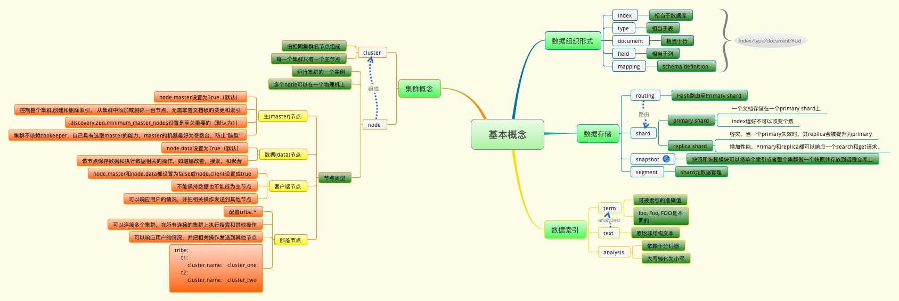
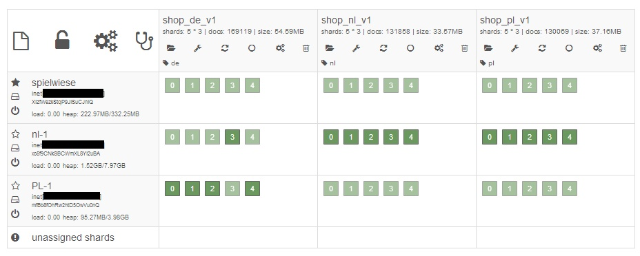

## [原文](https://www.jianshu.com/p/93d3487dc3ff)

# Elasticsearch简介

- 前言：这是我一边学习Elasticsearch（版本是5.2.0）一边写的博客，以后会慢慢完善

## [倒排索引](../倒排索引.md)


## Elasticsearche是什么

> Elasticsearch是一个基于Apache Lucene(TM)的开源搜索引擎。
无论在开源还是专有领域，Lucene可以被认为是迄今为止最先进、性能最好的、功能最全的搜索引擎库。
>
>  但是，Lucene只是一个库。想要使用它，你必须使用Java来作为开发语言并将其直接集成到你的应用中，
更糟糕的是，Lucene非常复杂，你需要深入了解检索的相关知识来理解它是如何工作的。
  Elasticsearch也使用Java开发并使用Lucene作为其核心来实现所有索引和搜索的功能，
  但是它的目的是通过简单的RESTful API
  来隐藏Lucene的复杂性，从而让全文搜索变得简单。
  不过，Elasticsearch不仅仅是Lucene和全文搜索，我们还能这样去描述它：
>  
> -  分布式的实时文件存储，每个字段都被索引并可被搜索
> -  分布式的实时分析搜索引擎
> -  可以扩展到上百台服务器，处理PB级结构化或非结构化数据
  
而且，所有的这些功能被集成到一个服务里面，你的应用可以通过简单的RESTful API，
用各种语言的客户端甚至命令行与之交互。

## Elasticsearch的功能

> 1. 分布式的搜索引擎和数据分析引擎
> 2. 全文检索，结构化检索，数据分析
> 3. 对海量数据进行近实时的处理 


## Elasticsearche的特点

> 1. 可以作为一个大型分布式集群（数百台服务器）技术，处理PB级数据，服务大公司；
也可以运行在单机上，服务小公司
>
> 2. Elasticsearch不是什么新技术，主要是将全文检索、数据分析以及分布式技术，合并在了一起，
才形成了独一无二的ES；lucene（全文检索），商用的数据分析软件（也是有的），分布式数据库（mycat）
> 
> 3. 对用户而言，是开箱即用的，非常简单，作为中小型的应用，直接3分钟部署一下ES，
就可以作为生产环境的系统来使用了，数据量不大，操作不是太复杂
>
> 4. 数据库的功能面对很多领域是不够用的（事务，还有各种联机事务型的操作）；
特殊的功能，比如全文检索，同义词处理，相关度排名，复杂数据分析，海量数据的近实时处理；
Elasticsearch作为传统数据库的一个补充，提供了数据库所不能提供的很多功能


 ## 其他
 
 - 一个ES集群由一个或多个节点（Node）组成，一般一个机器就是一个节点（node）
 -  节点下面有多个索引(index)
 -  索引下面有多个分片(shard),默认5 个分片，但是分片有主分片（shard）和副本(replica)，索引 一个索引大概就有10个分片【主分片和副分片】
 
 
 ## [在ElasticSearch中，集群(Cluster),节点(Node),分片(Shard),Indices(索引),replicas(备份)之间是什么关系？](https://www.zhihu.com/question/26446020)
 

 
> Cluster包含多个node，Indices不应该理解成动词索引，
 Indices可理解成关系数据库中的databases，
 Indices可包含多个Index，Index对应关系数据库中的database，它是用来存储相关文档的。
 
- Elasticsearch与关系数据的类比对应关系如下：
 ```
 Relational DB  ⇒ Databases ⇒ Tables ⇒ Rows    ⇒ Columns
 Elasticsearch  ⇒ Indices   ⇒ Types ⇒ Documents ⇒ Fields
 ```
 这里的document的可以理解为一个JSON序列对象。
 
 每个document可包含多个field。再来说说Shard，每个Index（对应Database）包含多个Shard，默认是5个，分散在不同的Node上，
 但不会存在两个相同的Shard存在一个Node上，这样就没有备份的意义了。
 
 Shard是一个最小的Lucene索引单元。当来一个document的时候，Elasticsearch通过对docid进行hash来确定其放在哪个shard上面，
 然后在shard上面进行索引存储。
 
 replicas就是备份，Elasticsearch采用的是Push Replication模式，
 当你往 master主分片上面索引一个文档，该分片会复制该文档(document)到剩下的所有 replica副本分片中，
 这些分片也会索引这个文档。
 
 我个人觉得这种模式很nice，有些时候对于一个document的进行索引可能生成很大的索引文件，
 会很占带宽，而只传输原始文件会好很多。
 
 当进行查询是，如果提供了查询的DocID，Elasticsearch通过hash就知道Doc存在哪个shard上面，
 再通过routing table查询就知道再哪个node上面，让后去node上面去取就好了。
 如果不提供DocID,那么Elasticsearch会在该Index（indics）shards所在的所有node上执行搜索预警，
 然后返回搜索结果，由coordinating node gather之后返回给用户。
 
 配置上需要把握什么样的原则，应该去看一个ES优化方面的资料，
 推荐两本书[ElasticSearch Server](https://book.douban.com/subject/21363179/)，
 [Mastering ElasticSearch](https://book.douban.com/subject/25848178/)一个机器不应定只部署一个node，
 
 一台机器可以虚拟化出多个虚拟机(至于虚拟化出多少看性能)，
 每个虚拟机都可以部署一个node.尤其在云计算环境下，如果租用云虚拟主机，
 谁知道它们是不是在同一台机器上。。



这张图可以展示出ES各组件之间的关系，整张表是一个Cluster，
横行是Nodes，竖列是Indices，深绿色方块是Primary Shards，
浅绿色方块是Replica Shards。


 
