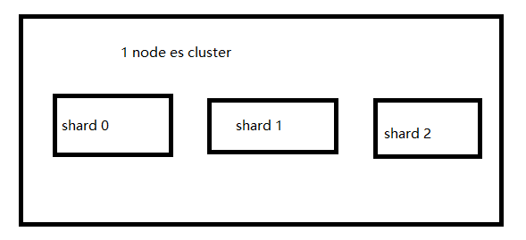
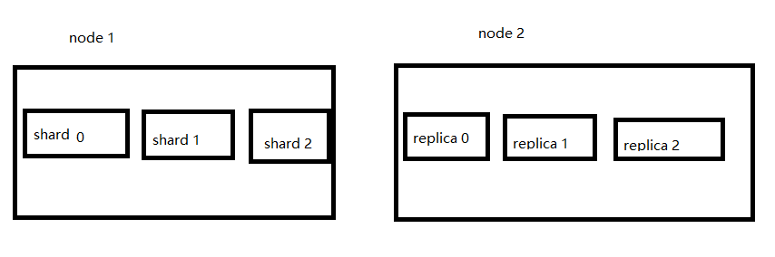
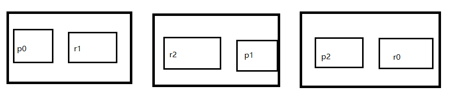
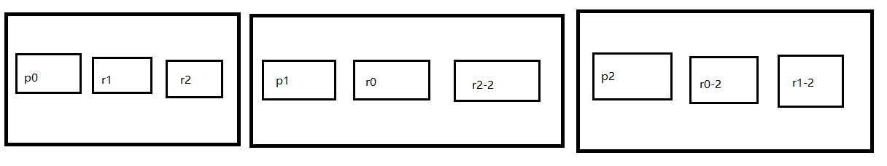

## [原文](https://www.jianshu.com/p/f4bdfda8b390)

# Elasticsearch的基础分布式架构以及shard相关知识和节点的扩容、容错

## 基础分布式架构

> 1. Elasticsearch对复杂分布式机制的透明隐藏特性
> 2. Elasticsearch的垂直扩容与水平扩容
> 3. 增加或减少节点时的数据rebalance
> 4. master节点
> 5. 节点对等的分布式架构

### Elasticsearch对复杂分布式机制的透明隐藏特性

> - Elasticsearch是一套分布式的系统，分布式是为了应对大数据量
>
> - 隐藏了复杂的分布式机制
>
> - cluster discovery（集群发现机制）-----比如当前我们启动了一个es进程，
> 当启动了第二个es进程时，这个进程作为一个node自动就发现了集群，并且加入了进去，还接受了部分数据（作为replica shard）
>
> - 分片机制----es自动地将我们创建的document插入的集群中，我们是不用关心数据是按照什么机制分片的、最后放入到那个shard中
> - shard负载均衡-----比如现在有10shard，集群中有3个节点，es会进行均衡的进行分配，以保持每个节点均衡的读写负载请求

### Elasticsearch的垂直扩容与水平扩容

> - 垂直扩容------用性能更强大的机器来替换当前的机器
>
> - 水平扩容------增加性能一般的机器作为新的节点

### 增减或减少节点时的数据rebalance

> - 我的理解就是当增减节点时，数据的重新分配

### master节点
> - master节点的主要作用就是管理es的元数据：

1. 创建或删除索引

2. 增加或删除节点
节点平等的分布式架构######
节点对等，每个节点都能接收所有的请求----shard节点和replica节点都能接受请求
自动请求路由----如果请求发到当前节点，但是该节点没有该请求需要数据，那么当前节点会去其他节点获取数据，并返回给此请求

3. 响应收集

### shard&replica机制


1. index包含多个shard

2. 每个shard都是一个最小工作单元，承载部分数据；每个shard都是一个lucene实例，
有完整的建立索引和处理请求的能力

3. 增减节点时，shard会自动在nodes中负载均衡

4. primary shard和replica shard，
每个document肯定只存在于某一个primary shard以及其对应的replica shard中，
不可能存在于多个primary shard

5. replica shard是primary shard的副本，负责容错，以及承担读请求负载

6. primary shard的数量在创建索引的时候就固定了，replica shard的数量可以随时修改

7. primary shard的默认数量是5，replica默认是1，
默认有10个shard，5个primary shard，5个replica shard

8. primary shard不能和自己的replica shard放在同一个节点上（否则节点宕机，
primary shard和副本都丢失，起不到容错的作用），
但是可以和其他primary shard的replica shard放在同一个节点上

#### 单node环境下创建index情况分析
创建索引前，设置shard和replica的数量

```json

PUT /test_index
{
   "settings" : {
      "number_of_shards" : 3,
      "number_of_replicas" : 1
   }
}

```

> 1. 单node环境下，创建一个index，有3个primary shard，3个replica shard
> 
> 2. 集群status是yellow
> 
> 3. 这个时候，只会将3个primary shard分配到仅有的一个node上去，
> 另外3个replica shard是无法分配的（一个shard的副本replica，他们两个是不能在同一个节点的）
> 
> 4. 集群可以正常工作，但是一旦出现节点宕机，数据全部丢失，而且集群不可用，无法承接任何请求

\
图一 单节点下，shard分配情况


此时再添加一个节点的话

> 1. 会把原来没有分配的replica 给分配到这个新节点上
> 
> 2. 当有请求的话，这个两个节点都可以接受请求

\
图二 增加至2个节点后的分布情况

- 紧接上面的场景，此时再加入一个节点话，此时shard和replica是如何分配的

\
图三 增加至3个节点后的情况

> 1. primary&replica自动负载均衡，6个shard，3 primary，3 replica
> 
> 2. 每个node有更少的shard，IO/CPU/Memory资源给每个shard分配更多，每个shard性能更好
> 
> 3. 扩容的极限，6个shard（3 primary，3 replica），
最多扩容到6台机器（每个机器一个shard/replica），每个shard可以占用单台服务器的所有资源，性能最好
超出扩容极限，动态修改replica数量，9个shard（3primary，6 replica），
扩容到9台机器，比3台机器时，拥有3倍的读吞吐量
3台机器下，9个shard（3 primary，6 replica），资源更少，但是容错性更好，
最多容纳2台机器宕机，6个shard只能容纳1台机器宕机---------只要剩下的节点中能包含完整的数据，那么宕机是不会造成太大影响的
分析9个shard，3个节点的情况


图四----3个节点，9个shard分配情况

如图四，是可以容忍2个节点宕机的，因为剩下的那个节点，是包含所有的数据的。

#### 宕机分析
假设图四 的第一个节点为master节点，如果此节点宕机

>  1. 集群重新选举master节点(假设为图四的第二个节点），且集群的状态变换为red
> 
>  2. 新master将replica提升为primary shard（r0提升为shard），集群的状态变换为yellow
> 
>  3. 重启宕机的节点，master将复制p0至节点一为replica，使用原有的shard并同步宕机后的修改，集群的状态变换为green

#### 集群的健康状况说明（green、yellow、red）

> green：每个索引的primary shard和replica shard都是active状态的
> 
> yellow：每个索引的primary shard都是active状态的，但是部分replica shard不是active状态，处于不可用的状态
> 
> red：不是所有索引的primary shard都是active状态的，部分索引有数据丢失了

 