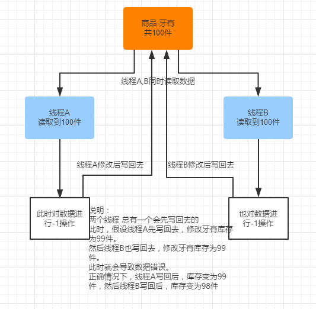

# Elasticsearch并发冲突问题



图示的冲突过程，其实就是es的并发冲突问题，会导致数据不准确
当并发操作es的线程越多，或者读取一份数据，供用户查询和操作的时间越长，在这段时间里，如果数据被其他用户修改，那么我们拿到的就是旧数据，基于旧数据去操作，就会导致错误的结果

## 悲观锁、乐观锁并发控制方案简单说明

> - 悲观锁(Pessimistic Lock), 顾名思义，就是很悲观，每次去拿数据的时候都认为别人会修改，
所以每次在拿数据的时候都会上锁，这样别人想拿这个数据就会block直到它拿到锁。
传统的关系型数据库里边就用到了很多这种锁机制，比如行锁，表锁等，读锁，写锁等，
都是在做操作之前先上锁。
>
> - 乐观锁(Optimistic Lock), 顾名思义，就是很乐观，每次去拿数据的时候都认为别人不会修改，
所以不会上锁，但是在更新的时候会判断一下在此期间别人有没有去更新这个数据，可以使用版本号等机制。
乐观锁适用于多读的应用类型，这样可以提高吞吐量，
像数据库如果提供类似于write_condition机制的其实都是提供的乐观锁。

- 两者之间的优缺点
> 悲观并发控制实际上是“先取锁再访问”的保守策略，为数据处理的安全提供了保证。
但是并发效率很低，同一时间只能有一条线程操作数据
悲观锁并发能力很高，不给数据加锁，大量线程并发操作，但是每次更新的时候，
都要先比对版本号，然后可能需要更新数据，再次修改，再写

es内部乐观锁并发控制方法
### _version字段说明
当向es插入一条数据时：

```json
PUT /test_index/test_type/1
{
  "test_field":"test_test"
}
//结果
{
  "_index": "test_index",
  "_type": "test_type",
  "_id": "1",
 "_version": 1,
  "result": "created",
  "_shards": {
    "total": 2,
    "successful": 1,
    "failed": 0
  },
  "created": true
}
```
第一次创建document时，它的_version就是1，每次对document进行修改或删除，
都会对这个_version进行版本号的加1，哪怕是删除，也会对这条数据的版本号加1
操作示例：修改数据两次，然后再删除

//修改一次
```json
PUT /test_index/test_type/1
{
  "test_field":"test_update_1"
}
{
  "_index": "test_index",
  "_type": "test_type",
  "_id": "1",
  "_version": 2,
  "result": "updated",
  "_shards": {
    "total": 2,
    "successful": 1,
    "failed": 0
  },
  "created": false
}
```

//再修改一次，用post进行修改

```json
POST /test_index/test_type/1/_update
{
  "doc":{
    "test_field":"test_update_2"
  }
}
{
  "_index": "test_index",
  "_type": "test_type",
  "_id": "1",
  "_version": 3,
  "result": "updated",
  "_shards": {
    "total": 2,
    "successful": 1,
    "failed": 0
  }
}
```

//删除，删除后_version也加1了
```json
DELETE /test_index/test_type/1
{
  "found": true,
  "_index": "test_index",
  "_type": "test_type",
  "_id": "1",
  "_version": 4,
  "result": "deleted",
  "_shards": {
    "total": 2,
    "successful": 1,
    "failed": 0
  }
}
```
### 基于_version的乐观锁并发控制

> 每次更新数据时都带上_version参数，
_version参数的值必须和更新前查询出来的_version值一致时，
才能更新成功（即：先查询当前数据的_version的值，假设为now_1，
然后更新时，带上参数_version=now_1去更新）；
如果_version的版本号不一致的话，此次的更新失败

//先构造一条数据
```json
PUT /test_index/test_type/2
{
  "test_field":"test_test_2"
}
```
//结果：
```json
{
  "_index": "test_index",
  "_type": "test_type",
  "_id": "2",
  "_version": 1,
  "result": "created",
  "_shards": {
    "total": 2,
    "successful": 1,
    "failed": 0
  },
  "created": true
}
```
//基于上面新插入的数据进行更新，即_version=1，此时更新成功
```json
PUT /test_index/test_type/2?version=1
{
  "test_field":"test_test_2_update"
}
{
  "_index": "test_index",
  "_type": "test_type",
  "_id": "2",
  "_version": 2,
  "result": "updated",
  "_shards": {
    "total": 2,
    "successful": 1,
    "failed": 0
  },
  "created": false
}
```

//再基于_version=1去更新，更新失败（原因是版本不一致），
```json
PUT /test_index/test_type/2?version=1
{
  "test_field":"test_test_2_update"
}
{
  "error": {
    "root_cause": [
      {
        "type": "version_conflict_engine_exception",
        "reason": "[test_type][2]: version conflict, current version [2] is different than the one provided [1]",
        "index_uuid": "WIZdikKPRte5A4mGncHNXQ",
        "shard": "2",
        "index": "test_index"
      }
    ],
    "type": "version_conflict_engine_exception",
    "reason": "[test_type][2]: version conflict, current version [2] is different than the one provided [1]",
    "index_uuid": "WIZdikKPRte5A4mGncHNXQ",
    "shard": "2",
    "index": "test_index"
  },
  "status": 409
}
```

### 基于external version的乐观锁并发控制

> es提供了一个新特性，就是说，你可以不用基于它提供的内部_version版本号进行并发控制，
可以基于自己维护的一个版本号来进行并发控制。

```
参数写法
？version=1&version_type=external
```

### ？version=1和？version=1&version_type=external的区别

- _version，只有当你提供的version与es中的_version一模一样的时候，才可以进行修改，只要不一样，就报错；

- 当version_type=external的时候，只有当你提供的version比es中的_version大的时候，才能完成修改

```json
GET /test_index/test_type/2
{
  "_index": "test_index",
  "_type": "test_type",
  "_id": "2",
  "_version": 2,
  "found": true,
  "_source": {
    "test_field": "test_test_2_update"
  }
}
```

如果external version更此条数据，_version的值应该大于2

```json
PUT /test_index/test_type/2?version=5&version_type=external
{
  "test_field":"test_test_external_vesion"
}

{
  "_index": "test_index",
  "_type": "test_type",
  "_id": "2",
  "_version": 5,
  "result": "updated",
  "_shards": {
    "total": 2,
    "successful": 1,
    "failed": 0
  },
  "created": false
}
```
