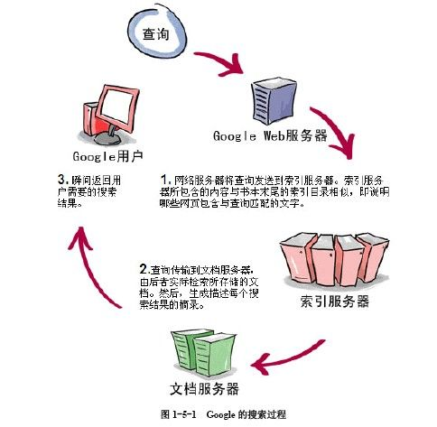

## [原文](https://www.zhihu.com/question/19937854)

# 搜索引擎的工作原理是什么？

Google 自己出了一集视频 叫 [How google works](https://www.youtube.com/watch?v=BNHR6IQJGZs) 

3分钟，有个概念，极简主义的杰作。

1. How Google Works

- 贴个图，自己感受下

- 详细点的 ：

## 详情

### 搜索引擎原理扫盲 

### 什么是搜索引擎 

搜索引擎是一个帮助用户搜索他们需要内容的计算机程序。
换一种说法，搜索引擎把计算机中存储的信息与用户的信息需求(information need)相匹配，
并把匹配的结果展示出来。 

- 举个例子：

大黄想卖肾买个iphone装逼，就查一下价格。它在google的搜索框里输入了”iphone 6 售价“，
点击搜索按钮。这里大黄的关键词“iphone 6 售价”就是他的信息需求。
Google在展示出搜索结果的那零点几秒之间，它的程序在巨大的数据库里按照关键字进行了查找，
终于计算出所有关于Iphone价格的网页。 

### 网络爬虫 

互联网上的信息存储在无数个服务器上，任何搜索引擎要想回答用户的搜索，
- 首先要把网页存在自己本地的服务器上，这靠的就是网络爬虫。
它不停的向各种网站发送请求，将所得到的网页存储起来。那么它怎么知道往哪发送请求呢？
通常的做法是利用网页之间的链接从一个网页出发，提取出指向其他页面的链接，
把它们当成将下次要请求的对象，不停重复这个过程。有很多细节要被考虑。
比如避免循环链接的网页；解析网页文档（通常是html格式，但也有很多其他格式）提取里边的链接；
当链接无法打开时对错误进行处理等。 

- 其次，如何高效的爬取数据也是一个很大的挑战。比如需要有成千上万个爬虫程序同时爬取数据，
高效的将数据存储起来以便之后分析等。这种分布式程序的实现是一个相当大的工程。

出于安全等因素考虑，很多网络服务器都有反恶意爬虫的功能。
尽管他们所采取策略各不相同，共同点是他们目标就是尽量只响应真人用户的请求。
但搜索引擎爬虫通常不需要担心这一点，因为大部分网站都希望提高自己的搜索排名，
欢迎搜索引擎爬虫到访。通常Google等搜索引擎都和网站之间有约定，
比如在网页上加个特殊标签，告诉爬虫这个网页是什么类型，包含什么信息等，
以便帮助爬虫更好的获取该网页内容。

好了，几乎整个互联网的内容都被Google的爬虫获得了。
Google怎么帮大黄找到卖iphone 6的网页呢？

### 索引 

互联网上的数据千千万万，大海捞针的搜索怎么就这么快？
难道Google发明了什么逆天科技吗？其实不是。这都要归功于搜索引擎的索引了。

如果要你在一本书里找一个关键词，应该怎么找？假设有充足的时间，最暴力的方法就是从头到尾看一遍，
最后总能找到关键词所在的位置。不过这是不是太麻烦了？有更好的方法吗？

有。索引就是帮助程序进行快速查找的。大家都用过新华字典。
字典前边的按照偏旁部首查字的部分就是索引。搜索引擎也一样。
这里要介绍第一个最重要的数据结构：反转列表（inverted list）。

搜索引擎所拥有的文档中出现的每一个单词都拥有一个反转列表。
它记录了这个单词在多少文档中出现，分别是哪些文档，每个文档分部出现多少次，
分别出现在什么位置等信息。比如Apple这个词出现在文档1，7，19，34，102。其中文档1中出现了3次，
分别在位置20，105，700。这样当搜索Apple时，Goolge就不用遍历所有的文档，
只需要查找每个单词对应的反转列表就可以知道这个词在哪里出现了。
每一个网络文档不仅只有文本信息。它还可能包括URL, 文件名，引用等部分。为了提高搜索质量，
搜索引擎需要对文档的不同部分分别处理，构造反转列表。
每一部分的单词都要被加入到这个词属于此部分的反转列表里。

索引除了反转列表还包含了很多各种数据结构。比如维护文档ID到实际文档的Document Manager，
存储每个单词属性信息的Term Dictionary，存储文档属性的数据结构等等。

创建索引是个巨大工程。首先是对文档进行解析和处理。互联网上的文档格式各种各样，
对每一种格式的文档都要有一个对应的解析器程序，这样才能忽略各种奇怪符号，提取出有用内容。
每一个解析器的实现都是一个繁琐且困难的任务。对于解析后的干净文档，
许多重要的自然语言处理算法就要派上用场。以英语为例，
需要进行<a href="https://zh.wikipedia.org/zh-hans/%E5%88%86%E8%AF%8D">分词</a>（
tokenzation，将一句话分割成一个个单词），词干提取（stemming， 将文本中出现的单词还原成它的原型），
（识别单词在一句话中的词性），创建[n-gram模型](https://zh.wikipedia.org/wiki/N%E5%85%83%E8%AF%AD%E6%B3%95) 等操作。

因为此文为目的是扫盲，就不深入讲解每个操作了。此外还需要<a href="https://link.zhihu.com/?target=https%3A//en.wikipedia.org/wiki/Named-entity_recognition" class=" wrap external" target="_blank" rel="nofollow noreferrer" data-za-detail-view-id="1043">识别文档中的命名实体(named entity)</a>，
比如将“iphone 6”作为一个词，而不是 “iphone” 一个， “6” 一个。
上述操作生成的信息都要存储下来。这样构造反转列表时就可以知道每个单词出现的位置，
出现个数等信息。

索引生成程序的一个设计目标就是高效。因此它被尽可能地运行在多个机器上。对于每个机器来说，
索引程序一边扫描输入文档，一边在内存中更新索引的数据结构。当内存中得数据大小超过一定阀值时，
这些内容被作为一个块(block)一次性写入硬盘文件中。
当所有文档扫描结束后这些块会再被合并成一个大的反转文件(Inverted file)。
因为每一个块都是排好序的，合并操作是线性的复杂度。因为数据量太大，
Google为了快速处理，发明了 <a href="https://link.zhihu.com/?target=https%3A//zh.wikipedia.org/wiki/MapReduce" class=" wrap external" target="_blank" rel="nofollow noreferrer" data-za-detail-view-id="1043">MapReduce</a>。
它现在是一个应用非常广泛的分布式计算框架。
MapReduce把一个大的任务分割成许多小任务，并下发给多个Mapper程序，
Mapper计算好的中间结果会发给多个Reducer程序继续处理，得到最终结果。
这个计算模型允许成千上万台机器同时运算，从而极大提高了运算效率。

反转文件要和访问机制(access mechanism)一起可以工作。
访问机制定义了如何通过一个单词找到它所对应的反转列表。
大概可以使用两种数据结构：b-tree 或 Hash table。

 

为了提高效率，索引中的单词和文档都用整形的ID表示而不是字符串。单词ID和字符串的映射由Term Dictionary维护，它还存储了关于此单词一些其他信息，
比如在多少文件中出现(document frequency)，在文档中出现概率(inverse document frequency = total document count／document frequency)。这些信息在搜索排序中会提供关键信息。

 

互联网内容是不停变化的，这必然导致索引不停被更新。然而建立好的索引中，各个单词的反转列表是紧密的拼接在一起的，这使得更新变得非常困难。
通常搜索引擎会积攒一批文件后才进行索引的更改，并且把索引分成静态和动态两个部分。
程序把所有更改都写入动态部分，并且周期性地将动态部分合并进静态部分中。
搜索时，动态和静态部分都会被访问。当从索引中删除一个文档时，
这个文档中出现的词对应的反转列表都会被修改，开销极大。
于是程序加入了“删除列表（delete lists）”来记录所有被删除的文档。
搜索时会查询删除列表来把已经被删除的文档从搜索结果中移除。
当删除列表足够大，垃圾回收机制会被触发，重新生成索引。

### 搜索 

有了索引，就可以快速找到所需内容了。前边说过搜索引擎根据用户的信息需求查找匹配的内容。
信息需求来自于用户输入。如何理解它有很大学问。
简单的说，大黄的搜索词“iphone 6 售价”会被解析成一个树形结构：叶子节点就是一个个关键词，
非叶子结点是搜索引擎自己定义的查询运算符（query operator）。
比如大黄的输入可以被解析成 AND(TERM(iphone 6)，TERM(售价) )

这里要说第到二个重要的数据结构：分数列表（score list）。每个单词同样对应一个。
它记录这个单词所出现的文档拥有的分数。为方便计算，分数通常是一个大于零小于一的浮点数。
在后边介绍结果排序时会讲如何给文档打分。 

在进行搜索时，TERM运算符查询出每一个单词对应的反转列表；
AND运算符将每个反转列表转换成分数列表，并且对于每个分数列表中的文档id集合进行求交集操作，
结果是一个新的分数列表，每个文档对应的分数是该文档在各个输入的分数列表中分数的乘积。

 除了AND, TERM运算符，搜索引擎一般还会定义许多其他运算符，比如OR用来对文档集合求并集操作；
  NEAR(term1, term2)用来查找所有term1 和 term2 相邻的文档, 
  WINDOW(5, term1, term2)用来查找term1 和 term2 相隔不超过5个单词的文档，WEIGHTED_SUM运算符来对分数进行加权和操作等。
  如何定义搜索运算符取决于不同的搜索引擎。 
  
  搜索引擎用把用户输入的搜索字符进行一些类似于创建索引时对文本的处理（tokenization, stemming, stopword removal, entity recognition），
  然后生成解析树。这个过程使用了各种技巧，常见的有： 
  
  multiple representation model</i>： 即一个文档的标题， URL，
  主体等部分被分别处理。比如大黄的搜索会被转换成： 
  
  AND(

WEIGHTED_SUM(0.1, URL(iphone 6), 0.2, TITLE(iphone 6), 0.7, BODY(iphone 6)),

WEIGHTED_SUM(0.1, URL(售价), 0.2, TITLE(售价), 0.7, BODY(售价)) )

 

或者

 

  
  
WEIGHTED_SUM(

0.1, AND(URL(iphone 6), URL(售价)), 

0.2, AND(TITLE(iphone 6), TITLE(售价)),

  
  
0.7, BODY(iphone 6), BODY(售价)),

)

 

  
  
<i>Sequential Dependency Model</i>：将搜索词按照以下三个不同方法生成解析树，最后把他们加权求和。三个方法分别是：

  
  
 

  <li>bag of words 匹配，即 AND(“iphone 6”， 售价);</li>
  <li>N-gram 匹配，即 NEAR(“Iphone 6”， 售价)</li>
  <li>短窗口匹配，即 WINDOW(8, “iphone 6”, 售价)</li>
  
  
 

最后加权求和：

WEIGHTED_SUM(0.7, AND(“iphone 6”， 售价), 0.2, NEAR(“Iphone 6”， 售价), 0.1 WINDOW(8, “iphone 6”, 售价) )

 

也可以把以上两种方法生成的解析树再进行加权求和来生成最终结果。

搜索引擎也可能会根据查询的类型选择不同的方法生成解析树。具体如何解析是没有定论的，加权操作中每部分的权重也没有定论。这需要根据历史数据做大量实验最终确定参数。总之，以上技巧最终目标是帮助搜索引擎更好理解用户的信息需求，以便查找出更高质量的文档。

 

排序

到这儿终于该说搜索引擎怎么给文档打分了。根据Google的论文<a href="https://link.zhihu.com/?target=http%3A//infolab.stanford.edu/%7Ebackrub/google.html" class=" wrap external" target="_blank" rel="nofollow noreferrer" data-za-detail-view-id="1043">Brin &amp; Page, WWW 1998</a>，
  他们计算文档最终分数是

 

 

其中就是文档doc对于搜索词query的信息检索得分，是该文档的 PageRank得分。在论文里他们没有说函数f是如何实现的。

 

信息检索得分（Information Retrieval Score）

假设互联网里的所有网页都包含有用的信息，且它们之间没有引用，这时打分唯一的依据就是这篇文章是否和查询相关。信息检索得分就是这种相关性的衡量。

 

有很多理论来计算IRscore。比如向量空间（Vector space retrieval model），概率理论（Probabilistic retrieval models），或统计语言模型（Statistical language models）等。这里不细说具体每个理论是怎么回事。关键要记住的是，它们的公式都和一个简单算法的公式非常接近。那就是tf-idf （term frequency–inverse document frequency）。

 

每个单词－文档组合都有一个tf-idf值。tf 表示此文档中这个单词出现的次数；df表示含有这个单词的文档的数量。通常如果一个单词在文档中出现次数越多说明这个文档与这个单词相关性越大。但是有的单词太常用了，比如英文里“the”，“a”，或者中文里“这里”，“就是”等，在任何一个文档中都会大量出现。idf表示一个文档含有此单词的概率的倒数，就是用来消除常用词干扰的。如果一个词在越多的文档中出现，说明这个词对于某一个文档的重要性就越低。算法的公式是：

 

 

搜索引擎如果只考虑tfidf分数，会非常容易被欺骗。因为tfidf只考虑网页和搜索词之前的相关性，而不考虑网页本身的内容质量。比如老中医可以在自己的网页上堆满治疗X病的关键词，这样当有人搜索相关内容时tfidf就会给出高分。PageRank就是专门祢补这个缺陷的。

 

PageRank 分数

PageRank是Google创始人Larry Page 和 Sergey Brin 当年在斯坦福读博期间搞出来的一个算法。凭借此算法他们创立Google，迎娶白富美走向人生巅峰的故事早已成为佳话。它的作用就是对网页的重要性打分。假设有网页A和B，A有链接指向B。如果A是一个重要网页，B的重要性也被提升。这种机制可靠的惩罚了没有被别的链接指向的欺诈网站。

 

以下内容涉及数学知识，不感兴趣可以跳过。

 

PageRank是按照以下规则计算分数的。假设有n个网页，他们的PageRank分数用n*1矩阵表示。PageRank定义了一个n*n矩阵表示网页间的连接关系。

 

 

其中n*n矩阵M的每一个元素表示从网页i跳转到网页j的概率。比如网页i有10个链接，其中2个指向网页j，那么的值就是0.2。E是一个常量，它是一个n*n矩阵且每个元素都为。用来将和加权求和。一般设为0.1~0.2之间。

 

对的求值是一个迭代过程：

 

 

这个迭代公式是有意义的。对于网页i，它的 PageRank得分为：

 

 

因为是由M和E的转置矩阵加权组成的，所以注意上式中展开后对应的矩阵M的值是。是经过平滑后的从网页t跳转到网页i的概率。这样即使t没有连接指向i，它的跳转概率也是。这个公式表示，网页i的PageRank得分由所有其他网页的PageRank得分分别乘以其跳转至网页i的概率之和得到。k是迭代次数。可以证明当k足够大时会收敛至一个定值。

 

搜索引擎将查询结果中的文档按照得分排序，最终给大黄显示出所有卖 iphone 6 的网页。

 

总结

搜索引擎是各种高深的算法和复杂的系统实现的完美结合，每一部分都在系统里起到关键作用。 洋洋洒洒写了这么多也只触及到皮毛，还有很多内容没有提及。比如搜索引擎如何评估搜索结果好坏，如何进行个性化搜索，如何进行分类搜索等。以后有机会再分别总结。

 

本文大部分知识来自卡内基梅隆大学“当年”的课程11-641 Search Engine and Web Mining，说“当年”是听说现在这个课已经被拆分成两个搜索引擎和文本挖掘两个课了。不过授课内容肯定更加丰富了。最后感谢Jamie Callan 教授和 Yiming Yang教授的教导！

