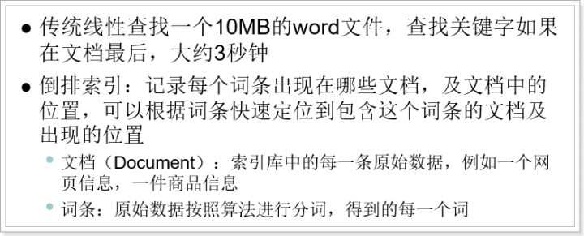
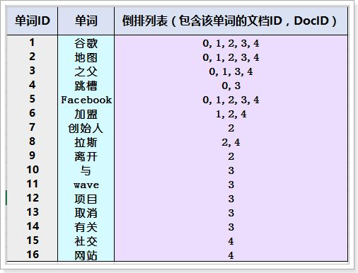
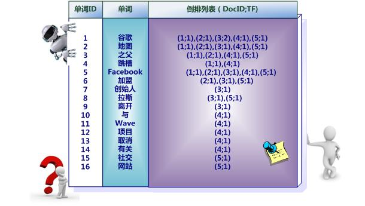

## [原文1](https://www.jianshu.com/p/93d3487dc3ff)
## [原文2](https://www.zhihu.com/question/23202010)

# 倒排索引
>

## 什么是全文搜索
> [全文检索](https://zh.wikipedia.org/zh-hans/%E5%85%A8%E6%96%87%E6%AA%A2%E7%B4%A2)是指计算机索引程序通过扫描文章中的每一个词，
对每一个词建立一个索引，指明该词在文章中出现的次数和位置，
当用户查询时，检索程序就根据事先建立的索引进行查找，
并将查找的结果反馈给用户的检索方式。
这个过程类似于通过字典中的检索字表查字的过程。
全文搜索搜索引擎数据库中的数据。

## 什么是[倒排索引](https://zh.wikipedia.org/wiki/%E5%80%92%E6%8E%92%E7%B4%A2%E5%BC%95)
> 倒排索引源于实际应用中需要根据属性的值来查找记录。
这种索引表中的每一项都包括一个属性值和具有该属性值的各记录的地址。
由于不是由记录来确定属性值，而是由属性值来确定记录的位置，
因而称为倒排索引(inverted index)。
带有倒排索引的文件我们称为倒排[索引文件](https://baike.baidu.com/item/%E7%B4%A2%E5%BC%95%E6%96%87%E4%BB%B6)，
简称[倒排文件(inverted file)](https://baike.baidu.com/item/%E5%80%92%E6%8E%92%E6%96%87%E4%BB%B6)。
 
倒排索引（英语：Inverted index），也常被称为反向索引、置入档案或反向档案，是一种索引方法，
被用来存储在全文搜索下某个单词在一个文档或者一组文档中的存储位置的映射。
它是文档检索系统中最常用的数据结构。 

## [倒排索引为什么叫倒排索引？](https://www.zhihu.com/question/23202010)

> 渣翻译的例子之一。
英文原名Inverted index，大概因为 Invert 有颠倒的意思，就被翻译成了倒排。
但是倒排这个名称很容易让人理解为从A-Z颠倒成Z-A。
个人认为翻译成转置索引可能比较合适。
一个未经处理的数据库中，一般是以文档ID作为索引，以文档内容作为记录。
而Inverted index 指的是将单词或记录作为索引，将文档ID作为记录，
这样便可以方便地通过单词或记录查找到其所在的文档。

> 一般叫反向索引，即根据关键字来找到文档，在全文检索中用的较多.

## 创建倒排索引，分为以下几步：

### 倒排索引简单实例
    

假设文档集合包含五个文档，每个文档内容如图下图所示，
在图中最左端一栏是每个文档对应的文档编号。
我们的任务就是对这个文档集合建立倒排索引。

1）创建文档列表：

图3-4

 lucene首先对原始文档数据进行编号（DocID），形成列表，就是一个文档列表
 
中文和英文等语言不同，单词之间没有明确分隔符号，所以首先要用分词系统将文档自动切分成单词序列。
这样每个文档就转换为由单词序列构成的数据流，为了系统后续处理方便，
需要对每个不同的单词赋予唯一的单词编号，同时记录下哪些文档包含这个单词，
在如此处理结束后，我们可以得到最简单的倒排索引（上图）。
在图3-4中，“单词ID”一栏记录了每个单词的单词编号，第二栏是对应的单词，
第三栏即每个单词对应的倒排列表。
比如单词“谷歌”，其单词编号为1，倒排列表为{0,1,2,3,4}，说明文档集合中每个文档都包含了这个单词。
 
 
 

2）创建倒排索引列表

 然后对文档中数据进行分词，得到词条。对词条进行编号，以词条创建索引。
 然后记录下包含该词条的所有文档编号（及其它信息）。

谷歌之父--> 谷歌、之父倒排索引创建索引的流程：

1） 首先把所有的原始数据进行编号，形成文档列表

2） 把文档数据进行分词，得到很多的词条，以词条为索引。保存包含这些词条的文档的编号信息。
搜索的过程：当用户输入任意的词条时，首先对用户输入的数据进行分词，得到用户要搜索的所有词条，
然后拿着这些词条去倒排索引列表中进行匹配。
找到这些词条就能找到包含这些词条的所有文档的编号。

然后根据这些编号去文档列表中找到文档
 
 

之所以说图3-4所示倒排索引是最简单的，是因为这个索引系统只记载了哪些文档包含某个单词，
而事实上，索引系统还可以记录除此之外的更多信息。

 图3-5 带有单词频率信息的倒排索引
 
 
上图是一个相对复杂些的倒排索引，
与图3-4的基本索引系统比，在单词对应的倒排列表中不仅记录了文档编号，
还记载了单词频率信息（TF），即这个单词在某个文档中的出现次数，之所以要记录这个信息，
是因为词频信息在搜索结果排序时，计算查询和文档相似度是很重要的一个计算因子，
所以将其记录在倒排列表中，以方便后续排序时进行分值计算。

在上图例子里，单词“创始人”的单词编号为7，对应的倒排列表内容为：（3:1），
其中的3代表文档编号为3的文档包含这个单词，
数字1代表词频信息，即这个单词在3号文档中只出现过1次，
其它单词对应的倒排列表所代表含义与此相同。

实用的倒排索引还可以记载更多的信息，
图3-6所示索引系统除了记录文档编号和单词频率信息外，
额外记载了两类信息，
即每个单词对应的“文档频率信息”（对应图3-6的第三栏）以及在倒排列表中记录单词在某个文档出现的位置信息。
 

 图3-6 带有单词频率、文档频率和出现位置信息
 

 