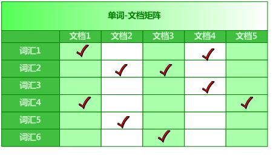
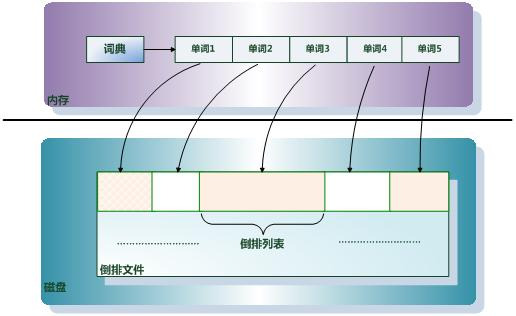

## [原文](https://blog.csdn.net/malefactor/article/details/7256305)

# 索引基础

 本节通过引入简单实例，介绍与搜索引擎索引有关的一些基础概念，
 了解这些基础概念对于后续深入了解索引的工作机制非常重要。

## 3.1.1单词—文档矩阵

       单词-文档矩阵是表达两者之间所具有的一种包含关系的概念模型，
图3-1展示了其含义。图3-1的每列代表一个文档，
每行代表一个单词，打对勾的位置代表包含关系。

                           
\
 图3-1 单词-文档矩阵

      从纵向即文档这个维度来看，每列代表文档包含了哪些单词，
比如文档1包含了词汇1和词汇4，而不包含其它单词。
从横向即单词这个维度来看，每行代表了哪些文档包含了某个单词。
比如对于词汇1来说，文档1和文档4中出现过单词1，而其它文档不包含词汇1。矩阵中其它的行列也可作此种解读。

     搜索引擎的索引其实就是实现“单词-文档矩阵”的具体数据结构。
可以有不同的方式来实现上述概念模型，比如“倒排索引”、“签名文件”、“后缀树”等方式。
但是各项实验数据表明，“倒排索引”是实现单词到文档映射关系的最佳实现方式，
所以本章主要介绍“倒排索引”的技术细节。

 

## 3.1.2倒排索引基本概念

      在本小节，我们会解释在倒排索引中常用到的一些专用术语，为了表达的便捷性，
在本书后续章节内会直接使用这些术语。

 

      文档(Document)：一般搜索引擎的处理对象是互联网网页，而文档这个概念要更宽泛些，
代表以文本形式存在的存储对象，相比网页来说，涵盖更多种形式，
比如Word，PDF，html，XML等不同格式的文件都可以称之为文档。
再比如一封邮件，一条短信，一条微博也可以称之为文档。
在本书后续内容，很多情况下会使用文档来表征文本信息。

 

     文档集合(Document Collection)：由若干文档构成的集合称之为文档集合。
比如海量的互联网网页或者说大量的电子邮件都是文档集合的具体例子。

 

     文档编号(Document ID)：在搜索引擎内部，会将文档集合内每个文档赋予一个唯一的内部编号，
以此编号来作为这个文档的唯一标识，这样方便内部处理，每个文档的内部编号即称之为“文档编号”，
后文有时会用DocID来便捷地代表文档编号。

 

    单词编号(Word ID)：与文档编号类似，搜索引擎内部以唯一的编号来表征某个单词，
单词编号可以作为某个单词的唯一表征。

 

   倒排索引(Inverted Index)：倒排索引是实现“单词-文档矩阵”的一种具体存储形式，
通过倒排索引，可以根据单词快速获取包含这个单词的文档列表。
倒排索引主要由两个部分组成：“单词词典”和“倒排文件”。

 

   单词词典(Lexicon)：搜索引擎的通常索引单位是单词，单词词典是由文档集合中出现过的所有单词构成的字符串集合，
单词词典内每条索引项记载单词本身的一些信息以及指向“倒排列表”的指针。

 

   倒排列表(PostingList)：倒排列表记载了出现过某个单词的所有文档的文档列表及单词在该文档中出现的位置信息，
每条记录称为一个倒排项(Posting)。根据倒排列表，即可获知哪些文档包含某个单词。

 

   倒排文件(Inverted File)：所有单词的倒排列表往往顺序地存储在磁盘的某个文件里，
这个文件即被称之为倒排文件，倒排文件是存储倒排索引的物理文件。

     关于这些概念之间的关系，通过图3-2可以比较清晰的看出来。

 
                                        
 图3-2 倒排索引基本概念示意图

  